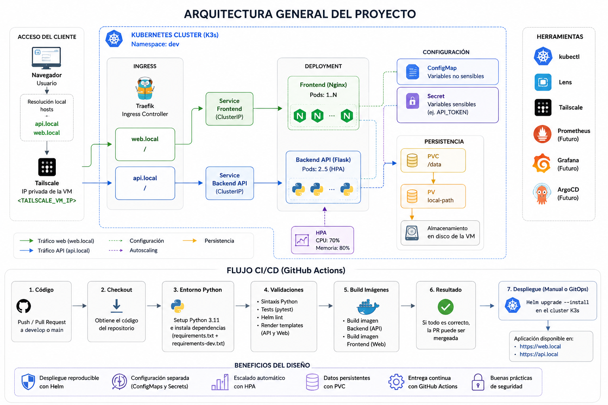
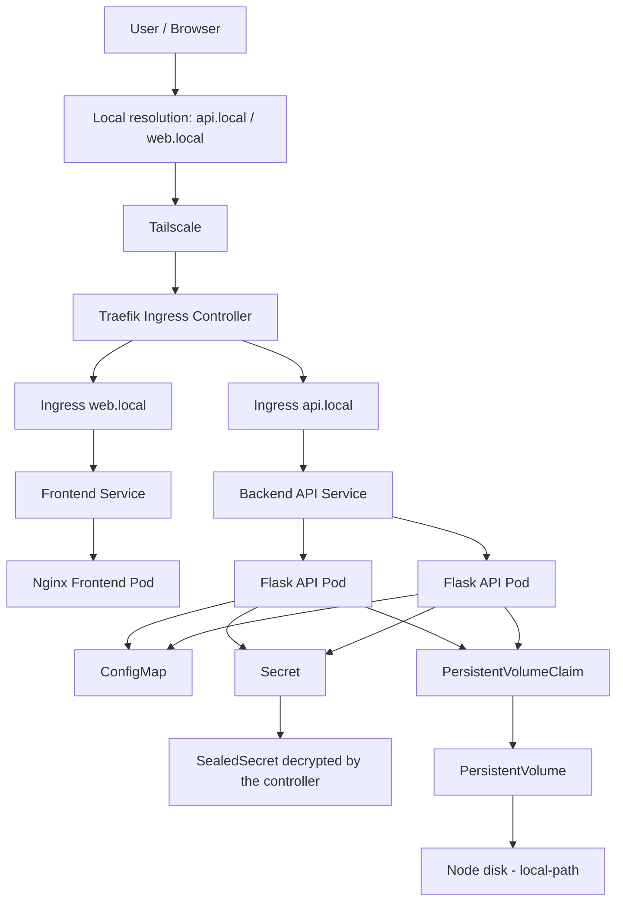
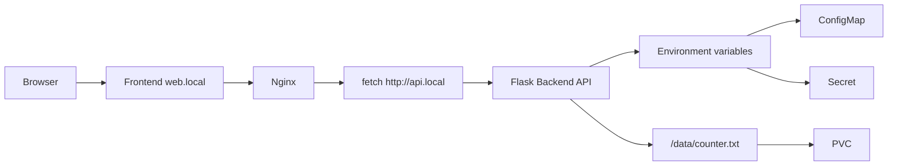
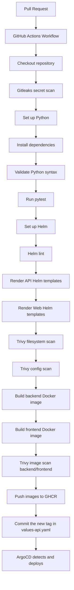
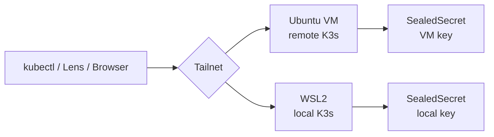

# DevSecOps Kubernetes Lab 🚀

[Español](README.md) | **English**

A hands-on lab to build, deploy and automate a cloud-native application on Kubernetes, with a focus on **DevOps, DevSecOps and Platform Engineering**.

The project simulates a modern software delivery chain at small scale:

```text
Code → Tests → CI → Docker → Helm → Kubernetes → Ingress → Configuration → Scaling → Persistence
```

> Security note: this README uses placeholders such as `<TAILSCALE_VM_IP>`, `<CLUSTER_API_IP>`, `<example-token>` or `<your-path>` to avoid publishing real IPs, tokens, certificates, full kubeconfigs, personal paths or internal details of the local environment.

---

## 1. Project goal

The goal is to progressively build a complete cloud-native environment, starting from a simple application and adding real layers of operations, automation and security.

The lab covers:

* Containerization with Docker.
* Application deployment on Kubernetes.
* Helm for packaging and deployment.
* Frontend/backend separation.
* Configuration management with ConfigMaps.
* Secret management with Kubernetes Secrets.
* Exposure through Ingress.
* Autoscaling with HPA.
* Persistence through Persistent Volumes and PVCs.
* CI with GitHub Actions.
* Validation of code, Helm charts and Docker images.
* A Git flow based on feature branches and Pull Requests.

The application is deliberately simple. The main focus is the platform, automation, operations and good practices around the software lifecycle.

---

## 2. System overview

The following image summarizes the overall architecture of the lab and the CI/CD flow implemented:



This view combines the three main building blocks of the project:

* The runtime architecture on Kubernetes, shared by both environments: the VM cluster and the local cluster on WSL2, both reachable through Tailscale.
* The platform that runs alongside the application inside the cluster: Prometheus and Grafana in the `monitoring` namespace, and ArgoCD in `argocd`. Prometheus discovers the API through a `ServiceMonitor`.
* The continuous integration flow on GitHub Actions, which validates, scans, publishes the images to GHCR and updates the tag in Git so that ArgoCD syncs the cluster.

Backend scaling is driven by an HPA with CPU and memory targets, shown in the diagram as the dashed arrow pointing at the Deployment.

---

## 3. Overall architecture



---

## 4. Application logical flow



---

## 5. Technology stack

### Application

* Python
* Flask
* Flask-CORS
* prometheus-flask-exporter
* HTML
* JavaScript
* Nginx

### Containers

* Docker
* Backend Dockerfile
* Frontend Dockerfile

### Kubernetes

* K3s
* Deployments
* Services
* Ingress
* ConfigMaps
* Secrets
* Horizontal Pod Autoscaler
* PersistentVolumeClaims
* `local-path` StorageClass

### Automation

* Helm
* GitHub Actions
* GitHub Container Registry
* Simplified GitFlow

### Observability

* Prometheus
* Grafana
* Prometheus Operator (ServiceMonitor)
* Alertmanager
* kube-state-metrics
* node-exporter

### GitOps

* ArgoCD
* Application CRD
* Auto-sync with selfHeal and prune

### Secret management

* Sealed Secrets
* kubeseal
* Gitleaks

### Operations tooling

* kubectl
* k9s
* Lens
* Tailscale

---

## 6. Repository structure

```text
Python-project/
│
├── .github/
│   └── workflows/
│       └── ci.yml
│
├── docs/
│   └── images/
│       └── architecture-overview.png
│
├── frontend/
│   ├── Dockerfile
│   └── index.html
│
├── infra/
│   ├── argocd/
│   │   ├── clusters/
│   │   │   ├── k3s-lab-wsl/
│   │   │   │   ├── app-api.yaml
│   │   │   │   ├── app-sealed-secrets-controller.yaml
│   │   │   │   ├── app-secrets-k3s-lab-wsl.yaml
│   │   │   │   └── app-web.yaml
│   │   │   └── ubuntu-devops/
│   │   │       ├── app-api.yaml
│   │   │       ├── app-sealed-secrets-controller.yaml
│   │   │       ├── app-secrets-ubuntu-devops.yaml
│   │   │       └── app-web.yaml
│   │   ├── argocd-ingress.yaml
│   │   └── argocd-values.yaml
│   │
│   ├── monitoring/
│   │   ├── api-servicemonitor.yaml
│   │   ├── grafana-ingress.yaml
│   │   └── kube-prometheus-stack-values.yaml
│   │
│   └── sealed-secrets/
│       ├── clusters/
│       │   ├── k3s-lab-wsl/
│       │   │   └── api-secret.yaml
│       │   └── ubuntu-devops/
│       │       └── api-secret.yaml
│       └── controller.yaml
│
├── python-app/
│   ├── templates/
│   │   ├── configmap.yaml
│   │   ├── deployment.yaml
│   │   ├── hpa.yaml
│   │   ├── ingress.yaml
│   │   ├── pvc.yaml
│   │   └── service.yaml
│   │
│   ├── Chart.yaml
│   ├── values.yaml
│   ├── values-api.yaml
│   └── values-web.yaml
│
├── tests/
│   └── test_main.py
│
├── Dockerfile
├── main.py
├── requirements.txt
├── requirements-dev.txt
├── pytest.ini
├── .dockerignore
├── .gitignore
├── README.md
└── README.en.md
```

---

## 7. Application components

### Backend API

The API is built with Flask.

Main endpoints:

```text
GET /
GET /counter
GET /healthz
GET /readyz
```

The `/` endpoint returns basic information about the application:

```json
{
  "message": "Hello from Python API 🚀",
  "app": "python-api",
  "environment": "dev",
  "secret_loaded": true
}
```

The `/counter` endpoint increments a persistent counter stored in:

```text
/data/counter.txt
```

Example response:

```json
{
  "message": "Persistent counter updated",
  "counter": 5,
  "file": "/data/counter.txt"
}
```

This endpoint is used to validate the behaviour of the persistent volume when pods are recreated.

**Health endpoints**

`/healthz` and `/readyz` exist for the Kubernetes probes and answer different questions:

* `/healthz` (liveness) only confirms that the process responds. If it fails, Kubernetes restarts the container.
* `/readyz` (readiness) checks that the data directory exists and is writable, which is what `/counter` needs. If it fails, it returns `503` and Kubernetes stops sending traffic to the pod without restarting it.

The liveness probe deliberately does not check external dependencies. If it did, a dependency outage would restart every replica at once without fixing anything; those checks belong in the readiness probe, which takes the pod out of rotation and brings it back once the dependency recovers.

Both endpoints are excluded from metrics with `@metrics.do_not_track()`. The kubelet calls them every few seconds, and counting them would fill the traffic charts with requests from the cluster itself.

**Application server**

The API is served by Gunicorn rather than Flask's development server. A master process supervises its workers, replaces any that exit and, on `SIGTERM`, finishes in-flight requests before shutting down.

It runs with one worker and four threads. On Kubernetes, capacity grows through replicas and the HPA, not through workers inside the pod, and there are two concrete reasons not to add more:

* The usual `(2 × cores) + 1` formula counts the node's cores, not the container's CPU limit, and on a large node it would start far more processes than fit in 500m.
* Each worker is a process with its own Prometheus counters. With several, each read of `/metrics` would return a different worker's numbers, unless the client's multiprocess mode is configured.

---

### Frontend

The frontend is served by Nginx and consumes the API through JavaScript.

Responsibilities:

* Show a simple web interface.
* Query the backend.
* Display the API response.
* Validate frontend/backend communication inside the cluster.

---

## 8. Docker

### Backend

Building the backend image (local/development use):

```bash
docker build -t python-k8s-app:latest .
```

The container's main process is Gunicorn:

```dockerfile
CMD ["gunicorn", "--bind", "0.0.0.0:8080", "--workers", "1", "--threads", "4", "--access-logfile", "-", "--no-control-socket", "main:app"]
```

* The list form (*exec form*) makes Gunicorn the container's process 1. With the string form, process 1 would be a shell that does not forward `SIGTERM`, and Kubernetes would end up killing the container with `SIGKILL` once the grace period expires, cutting off in-flight requests.
* `--access-logfile -` sends the access log to standard output, where Kubernetes collects it.
* `--no-control-socket` disables the control interface that Gunicorn creates by default in `$HOME/.gunicorn/`. The container runs without a home directory and with a read-only root filesystem, and the interface is not used.

### Frontend

Building the frontend image (local/development use):

```bash
cd frontend
docker build -t frontend-app:latest .
```

The image is based on `nginxinc/nginx-unprivileged:alpine` and upgrades its packages during the build:

```dockerfile
USER root
RUN apk upgrade --no-cache
USER 101
```

This picks up patches published by Alpine before the base image is rebuilt. The base image runs unprivileged, so the upgrade requires switching to root temporarily and back to user `101` afterwards; leaving out the last line would leave the image running as root.

### Publishing to GHCR (GitHub Container Registry)

The CI pipeline automatically builds and publishes both images to GHCR on every push to `develop`/`main`, tagged with the short commit SHA:

```text
ghcr.io/oscarhidalgo93/python-k8s-app:<short-sha>
ghcr.io/oscarhidalgo93/frontend-app:<short-sha>
```

The push to GHCR happens **after** the image passes the Trivy scan and **only** on `push` events (not on Pull Requests), so that images from branches that have not been integrated yet are never published. Both packages are public, so K3s can `pull` them without credentials.

With this, the manual flow of building the image on the VM, exporting it with `docker save` and importing it into containerd with `sudo k3s ctr images import` **is no longer needed** to deploy to the cluster.

---

## 9. Kubernetes

The Kubernetes environment runs on K3s, on an Ubuntu VM and on a local cluster on WSL2 (section 24).

Main namespace:

```text
dev
```

General check:

```bash
kubectl get all -n dev
```

---

## 10. Helm

The project uses a single reusable Helm chart:

```text
python-app
```

This chart deploys both the backend and the frontend using different values files.

### Main Helm files

```text
values.yaml       → shared configuration
values-api.yaml   → backend-specific configuration
values-web.yaml   → frontend-specific configuration
```

The image tag (`image.tag`) is set in `values-api.yaml` and `values-web.yaml`, and CI updates it on every integration into `develop` (section 23). The template marks it as mandatory with `required`, so a deployment without a tag fails at render time rather than in the cluster.

### Manual deployment

Deployments are normally handled by ArgoCD. Without it, each release is installed with its own combination of files:

```bash
cd python-app

helm upgrade --install python-api . -n dev -f values.yaml -f values-api.yaml
helm upgrade --install python-web . -n dev -f values.yaml -f values-web.yaml
```

### values.yaml as a contract

`values.yaml` declares every key the chart supports, even when empty, because it is where anyone looks to see what can be configured. Its defaults follow an explicit rule:

* Defaults hold what is safe for any release and does not change its normal behaviour, such as the deployment strategy.
* Anything that depends on how each application behaves is enabled in that application's own values file, such as the probes or the HPA memory target.

### Health probes

Each release declares its probes in its values file, and the template only includes them when they exist:

```yaml
livenessProbe:
  httpGet:
    path: /healthz
    port: 8080
  periodSeconds: 10
  failureThreshold: 3

readinessProbe:
  httpGet:
    path: /readyz
    port: 8080
  periodSeconds: 5
  failureThreshold: 2
```

Readiness runs more often and is more sensitive than liveness because taking a pod out of rotation is cheap and reversible, while restarting it is not. Liveness tolerates about thirty seconds of failures before acting. The frontend uses both probes on `/`, which is enough for Nginx serving static content.

### Deployment strategy

Every release inherits a rolling update that never reduces available capacity:

```yaml
strategy:
  type: RollingUpdate
  rollingUpdate:
    maxSurge: 1
    maxUnavailable: 0
```

Kubernetes first creates an extra pod, waits for it to pass the readiness probe and only then removes an old one. The cost is one additional pod for a few seconds. The frontend runs two replicas, since with a single one any issue with that pod leaves it without service, however good the strategy.

This is verified by sending continuous requests in one terminal:

```bash
timeout 90 bash -c 'while true; do curl -s -o /dev/null -w "%{http_code}\n" --max-time 2 -H "Host: web.local" http://127.0.0.1/; sleep 0.2; done' | sort | uniq -c
```

And forcing a rollout in another:

```bash
kubectl rollout restart deployment/python-web-python-app -n dev
```

Every response must be `200`. ArgoCD does not revert the restart, because the annotation added by `rollout restart` is not declared in Git.

The strategy has limits: it needs room on the node for the extra pod, and it does not suit applications that cannot run two versions side by side, which require `type: Recreate`. That is why it is a default that each release can override.

### Validation

```bash
helm lint .
helm template test-api . -f values.yaml -f values-api.yaml
helm template test-web . -f values.yaml -f values-web.yaml
```

`helm template` checks that the templates produce YAML, not that the result is a valid Kubernetes object. That validation is done by the API server without persisting anything:

```bash
helm template python-api . -f values.yaml -f values-api.yaml | kubectl apply --dry-run=server -n dev -f -
```

---

## 11. Ingress

K3s ships Traefik as its default Ingress Controller.

Hosts used:

```text
api.local
web.local
```

Example of local resolution on the client machine:

```text
<TAILSCALE_VM_IP> api.local
<TAILSCALE_VM_IP> web.local
```

Hosts file on Windows:

```text
C:\Windows\System32\drivers\etc\hosts
```

> `<TAILSCALE_VM_IP>` is used as a placeholder to avoid publishing the environment's real IP addresses.

---

## 12. ConfigMaps

Non-sensitive configuration is managed through ConfigMaps.

Example:

```yaml
APP_NAME: python-api
ENVIRONMENT: dev
```

Validation:

```bash
kubectl describe configmap python-api-python-app-config -n dev
```

Check inside the pod:

```bash
kubectl exec -it -n dev <pod-api> -- printenv | grep -E "APP_NAME|ENVIRONMENT"
```

---

## 13. Secrets

Sensitive data is managed through Kubernetes Secrets.

Example:

```text
API_TOKEN
```

The application does not expose the secret's value, it only reports whether it was loaded:

```json
{
  "secret_loaded": true
}
```

Documentation-safe example:

```yaml
API_TOKEN: <example-token>
```

Validation:

```bash
kubectl get secrets -n dev
kubectl describe secret python-api-python-app-secret -n dev
```

### How secret management evolved

The project went through three stages, each one solving the problem of the previous one:

```text
1. Plain-text apiToken in values-api.yaml   → detectable by Gitleaks
2. Injection with --set at deploy time      → out of Git, manual step
3. Sealed Secrets                           → encrypted in Git, automatic
```

The second stage removed the value from the repository, but left a piece of state outside Git: the `--set` had to be remembered on every deployment, and ArgoCD overwrote the Secret with an empty string on every sync.

### Sealed Secrets

Sealed Secrets uses asymmetric cryptography: `kubeseal` encrypts with the cluster's public key, and only the controller, holding the private key that never leaves it, can decrypt.

This makes it possible to version the **encrypted** secret in a public repository safely, because its security does not depend on the repository being private.

```text
Plain Secret (local, ephemeral)
      │  kubeseal encrypts with the public key
      ▼
SealedSecret ─────────────► Git (safe, even if public)
                                  │  ArgoCD applies it
                                  ▼
                       The controller decrypts with the private key
                                  ▼
                          Regular Secret in the cluster
```

Installing the controller, versioned in `infra/sealed-secrets/controller.yaml`:

```bash
kubectl apply -f infra/sealed-secrets/controller.yaml
```

The `kubeseal` client:

```bash
curl -sLO https://github.com/bitnami-labs/sealed-secrets/releases/download/v0.39.0/kubeseal-0.39.0-linux-amd64.tar.gz
tar -xzf kubeseal-0.39.0-linux-amd64.tar.gz kubeseal
sudo install -m 755 kubeseal /usr/local/bin/kubeseal
```

Generating and sealing a secret without the plain value ever reaching the repository:

```bash
kubectl create secret generic python-api-python-app-secret \
  --namespace dev \
  --from-literal=API_TOKEN='<token>' \
  --dry-run=client -o yaml > /tmp/secret-plain.yaml

kubeseal --format yaml --controller-namespace kube-system \
  < /tmp/secret-plain.yaml > python-app/templates/sealedsecret.yaml

rm /tmp/secret-plain.yaml
```

The result is stored in `python-app/templates/sealedsecret.yaml` and ArgoCD deploys it like any other resource in the chart.

Validation:

```bash
kubectl get secret python-api-python-app-secret -n dev -o jsonpath='{.data.API_TOKEN}' | base64 -d
```

### Considerations

* **The name matters.** The controller creates the Secret with the same name as the SealedSecret, which must match the one the Deployment expects.
* **The sealing key belongs to each cluster.** It is generated the first time the controller starts, so the same encrypted file does not work for two environments: each cluster needs its own sealing of the same secret.
* **Sealing is bound to a namespace and a name.** A SealedSecret copied into another namespace does not decrypt, which prevents anyone from reusing the encrypted file in a space under their control.
* **Gitleaks flags SealedSecrets as a false positive.** Encrypted content has high entropy by definition, indistinguishable from a real token. It is scoped by path in `.gitleaks.toml`, with its justification.
* **The controller's private key is irreplaceable.** If the cluster is lost without backing it up, every SealedSecret becomes unreadable:

```bash
kubectl get secret -n kube-system -l sealedsecrets.bitnami.com/sealed-secrets-key -o yaml > sealed-secrets-key-backup.yaml
```

> That file is the master key for every secret in the cluster and must never be pushed to the repository.

* **Sealed Secrets protects the path to Git, not the secret inside the cluster.** Once decrypted it is a regular Secret, readable by anyone with read access to that namespace. Restricting that access is RBAC's job.

> Real Secret values, full kubeconfigs, certificates, tokens or credentials must never be published in the repository.

---

## 14. HPA - Horizontal Pod Autoscaler

The backend is ready to scale automatically through an HPA.

Example configuration:

```yaml
autoscaling:
  enabled: true
  minReplicas: 2
  maxReplicas: 5
  targetCPUUtilizationPercentage: 70
  targetMemoryUtilizationPercentage: 80
```

Each metric is only included in the HPA when the release declares its target. The memory metric deliberately has no default: the HPA assumes the per-pod metric drops when replicas are added, which holds for CPU but not for the memory of a runtime that does not give back what it frees. Since the HPA follows whichever metric asks for the most replicas, memory that never drops would prevent scaling down.

The percentage is computed against the `requests`. With Gunicorn, each API pod uses about 45Mi at idle, which against the previous 64Mi request meant 70%, ten points away from the target. The request was raised to 128Mi so that idle usage does not trigger scaling without load.

Check:

```bash
kubectl get hpa -n dev
kubectl describe hpa python-api-python-app -n dev
```

During load testing, the API scaled correctly up to 5 pods, validating:

* Metrics Server.
* HPA.
* CPU/memory requests.
* Automatic scaling of the Deployment.
* Visualization of the scaling in Lens.

---

## 15. Persistence with PVC

The API mounts a persistent volume at:

```text
/data
```

The PVC is created through Helm:

```text
python-api-python-app-pvc
```

Check:

```bash
kubectl get pvc -n dev
```

Expected output:

```text
NAME                        STATUS   CAPACITY   ACCESS MODES   STORAGECLASS
python-api-python-app-pvc   Bound    1Gi        RWO            local-path
```

Persistence test:

```bash
curl http://api.local/counter
curl http://api.local/counter
kubectl delete pod -n dev -l app.kubernetes.io/instance=python-api
curl http://api.local/counter
```

The counter keeps going after the pods are recreated, proving real persistence.

> Note: the file-based counter is a technical demo to validate the PVC. In a production environment, shared state should live in a database, Redis or another specialized service.

The design also has two known limitations. The volume is `ReadWriteOnce`, so with several nodes only the pods on the node it is attached to could mount it. And the increment is done by reading, adding and writing from the application, a non-atomic sequence in which two simultaneous replicas lose increments. Both will be solved by moving the counter to Redis, whose `INCR` is atomic on the server.

---

## 16. Tests with pytest

The project includes basic tests with pytest.

File:

```text
tests/test_main.py
```

The tests validate:

* The `/` endpoint.
* The `/counter` endpoint.
* The counter increment logic.
* The use of a temporary path so tests do not depend on the real PVC.

Running locally:

```bash
python -m pytest -v
```

pytest configuration:

```ini
[pytest]
pythonpath = .
testpaths = tests
```

This allows the tests to import `main.py` correctly.

---

## 17. Python virtual environment

On Ubuntu, using a virtual environment is recommended to avoid modifying the system-managed Python.

Create the environment:

```bash
python3 -m venv .venv
```

Activate it:

```bash
source .venv/bin/activate
```

Install dependencies:

```bash
python -m pip install --upgrade pip
python -m pip install -r requirements.txt
python -m pip install -r requirements-dev.txt
```

Run the tests:

```bash
python -m pytest -v
```

Leave the environment:

```bash
deactivate
```

> The `.venv/` directory must not be pushed to the repository.

---

## 18. GitHub Actions CI

The project includes a CI pipeline in:

```text
.github/workflows/ci.yml
```

The pipeline runs on:

* Push to `develop`.
* Push to `main`.
* Pull Request to `develop`.
* Pull Request to `main`.

### CI flow



> The GHCR push and tag update steps only run on `push` events to `develop` or `main`, never on Pull Requests.

### Current checks

CI validates:

* Installation of Python dependencies.
* Syntax of `main.py`.
* Tests with pytest.
* Helm lint.
* Rendering of the API Helm templates.
* Rendering of the Web Helm templates.
* Backend Docker image build.
* Frontend Docker image build.
* Gitleaks: secret detection across the commit history.
* Trivy filesystem scan.
* Trivy config scan of the Helm chart.
* Trivy image scan of both Docker images.

This catches errors before changes are integrated into the project's main branches.

In addition, on push to `develop` the pipeline publishes the images to GHCR and updates the tag in `values-api.yaml`, closing the loop towards automatic deployment through ArgoCD.

---

## 19. GitFlow in use

Simplified branching model:

```text
main
└── develop
    ├── feature/hpa-autoscaling
    ├── feature/persistent-volumes
    ├── feature/github-actions-devsecops-ci
    ├── feature/security-scans
    ├── feature/ghcr-registry
    ├── feature/monitoring
    ├── feature/argocd
    ├── feature/hpa-argocd-fix
    ├── feature/argocd-autosync
    ├── feature/ci-ima-tag
    ├── feature/sealed-secrets
    └── feature/readme
```

Workflow:

```text
feature/* → Pull Request → develop → main
```

### Branches and environments

Since the lab has two clusters, each main branch maps to an environment:

```text
develop  →  local cluster (WSL2)   development: receives each feature when merged
main     →  VM                     demo: stable, only changes on promotion
```

Each cluster runs its own ArgoCD, with Applications pointing at their branch through `targetRevision`. Promoting a version to the demo means merging `develop` into `main`: the merge that already closed the flow gains an operational effect, and working on `develop` can no longer break the demo.

Images are not rebuilt on promotion. CI publishes them to GHCR and pins their tag in the values when integrating into `develop`; the merge carries that tag to `main`, and the VM deploys an image that already exists and has already been scanned.

---

## 20. Remote access with Tailscale

Tailscale is used to reach the lab without depending on the local network.

The kubeconfig points at the VM's private Tailscale IP:

```yaml
server: https://<TAILSCALE_VM_IP>:6443
```

K3s was configured with `tls-san` to include the Tailscale IP in the API Server certificate:

```yaml
tls-san:
  - <TAILSCALE_VM_IP>
```

This allows `kubectl` and Lens to be used from the client machine against the VM's K3s cluster.

### WSL2 node

The local cluster joins the same tailnet, so both environments are reached through the same mechanism and with an identity that does not depend on the underlying network:

```bash
sudo systemctl enable --now tailscaled
sudo tailscale up --hostname=<NODE_NAME>
```

The API Server certificate is extended by declaring the additional names in `/etc/rancher/k3s/config.yaml`:

```yaml
tls-san:
  - <TAILSCALE_WSL_IP>
  - <MAGICDNS_NAME>
```

K3s regenerates the certificate when the service restarts and keeps the previous SANs, so earlier access paths remain valid. With `tailscaled` enabled in systemd, the node's identity survives distro restarts.

> For security reasons, this README does not publish real IPs, tokens, certificates, full kubeconfigs or personal paths from the local environment.

---

## 21. Lens

Lens is used to visualize and operate the cluster.

It allows reviewing:

* Pods.
* Deployments.
* Services.
* Ingress.
* Namespaces.
* HPA.
* PVC.
* Logs.
* Metrics.

While validating the HPA, Lens made it possible to watch the API scale up to 5 pods.

The client points at the cluster's stable name instead of an address:

```yaml
server: https://<MAGICDNS_NAME>:6443
```

Lens should be configured to **sync a kubeconfig file** on disk (*Preferences → Kubernetes → Kubeconfig Syncs*) rather than pasting its contents. A pasted copy is frozen at the moment it was pasted and does not pick up later changes, and pasting the same file twice duplicates all its contexts in the catalog.

---

## 22. Observability with Prometheus and Grafana

Observability is deployed through the `kube-prometheus-stack` chart, which includes Prometheus, Grafana, Alertmanager, kube-state-metrics and node-exporter.

Namespace used:

```text
monitoring
```

### Installation

```bash
helm repo add prometheus-community https://prometheus-community.github.io/helm-charts
helm repo update

helm install kube-prometheus-stack prometheus-community/kube-prometheus-stack \
  -n monitoring --create-namespace \
  --version 87.21.0 \
  -f infra/monitoring/kube-prometheus-stack-values.yaml
```

The chart version is pinned so that both clusters run the same one. Without that argument, each installation gets whatever was published that day and the environments drift apart without anyone deciding it.

Resources are declared in `infra/monitoring/kube-prometheus-stack-values.yaml`, which is not a Kubernetes manifest but the chart's configuration:

```yaml
grafana:
  resources:
    requests: { cpu: 50m, memory: 128Mi }

prometheus:
  prometheusSpec:
    resources:
      requests: { cpu: 100m, memory: 256Mi }
      limits:   { cpu: 500m, memory: 1Gi }
```

`prometheusSpec` does not configure a Deployment: its values go into the `Prometheus` object, the custom resource that the Operator later turns into a StatefulSet. That is why the render is checked on that object and not on a Deployment.

The stack is installed in full, including Alertmanager and node-exporter.

### The release name is part of the contract

The first argument to `helm install` is the release name, and the chart uses it to build the names of its resources and the `release` label of the objects it creates. Two files in the repository depend on that name being `kube-prometheus-stack`:

* `grafana-ingress.yaml` routes to the `kube-prometheus-stack-grafana` Service. With another name, the Ingress would point at a non-existent Service and access would return a proxy error.
* `api-servicemonitor.yaml` carries the `release: kube-prometheus-stack` label, which is exactly what the Prometheus deployed by the chart selects. With another name, the Operator would ignore the ServiceMonitor without logging any error: there would simply be no targets.

The second failure is the more dangerous of the two, because nothing flags it until someone misses a metric.

### Grafana admin password

It is not declared in any file of the repository. When none is provided, the chart generates a random one and stores it in the `kube-prometheus-stack-grafana` Secret:

```bash
kubectl get secret -n monitoring kube-prometheus-stack-grafana -o jsonpath='{.data.admin-password}' | base64 -d
```

The value is computed at render time, so a later `helm upgrade` can replace it and lock out whoever had already logged in. Pinning it without writing the password into Git means using `grafana.admin.existingSecret`, pointing at a Secret managed as a SealedSecret, just like the API token.

### Accessing Grafana

Grafana is exposed through a Traefik Ingress:

```text
grafana.local
```

The manifest lives in `infra/monitoring/grafana-ingress.yaml`:

```bash
kubectl apply -f infra/monitoring/grafana-ingress.yaml
```

Local resolution on the client machine:

```text
<TAILSCALE_VM_IP> grafana.local
```

The chart includes preconfigured Kubernetes dashboards showing CPU, memory and pod status per namespace. This complements the HPA with real metrics instead of only the output of `kubectl get hpa`.

### Application metrics

The API is instrumented with `prometheus-flask-exporter`, which automatically exposes request, latency and response code metrics:

```text
GET /metrics
```

Initialization in `main.py`:

```python
from prometheus_flask_exporter import PrometheusMetrics

app = Flask(__name__)
CORS(app)
metrics = PrometheusMetrics(app, path="/metrics")
```

### ServiceMonitor

To let Prometheus discover and scrape the API automatically, a `ServiceMonitor` (a Prometheus Operator CRD) is used, defined in `infra/monitoring/api-servicemonitor.yaml`:

```bash
kubectl apply -f infra/monitoring/api-servicemonitor.yaml
```

Four elements must match for discovery to work:

* The `release: kube-prometheus-stack` label, without which the Operator ignores the ServiceMonitor.
* The `namespaceSelector`, since the ServiceMonitor lives in `monitoring` and the Service in `dev`.
* The `selector.matchLabels`, which must match the Service's labels.
* The port name (`port: http`), which is why the Service defines `name: http` in its template.

### Validation

```bash
kubectl get servicemonitor -n monitoring
kubectl port-forward -n monitoring svc/kube-prometheus-stack-prometheus 9090:9090
```

In `http://localhost:9090` → `Status` → `Target health`, the API targets must show as `UP`. On WSL2 that forwarding does not reach the Windows browser, so the check is done from Grafana or by querying the Prometheus API. Its image is *distroless* and includes neither a shell nor an HTTP client, so the query is run from a container that has them:

```bash
kubectl exec -n monitoring deploy/kube-prometheus-stack-grafana -c grafana -- \
  curl -sG http://kube-prometheus-stack-prometheus.monitoring:9090/api/v1/query \
  --data-urlencode 'query=up{namespace="dev"}'
```

A value of `1` for each API pod confirms the whole chain: Service, ServiceMonitor, Operator and Prometheus.

Example query in Grafana or Prometheus:

```text
rate(flask_http_request_total[5m])
```

> Note: the `/metrics` endpoint is reachable through the API's Ingress. In a production environment it should be served on a separate port that is not publicly exposed, or access should be restricted with a NetworkPolicy so that only Prometheus can query it, since it exposes information about the application's routes, traffic and errors.

---

## 23. GitOps with ArgoCD

ArgoCD introduces the declarative model: the cluster's desired state lives in Git and ArgoCD reconciles it continuously. Deployment stops being a manual action (`helm upgrade`) and becomes the consequence of a commit.

Namespace used:

```text
argocd
```

### Installation

```bash
kubectl create namespace argocd

helm repo add argo https://argoproj.github.io/argo-helm
helm repo update

helm install argocd argo/argo-cd -n argocd \
  --version 10.3.0 \
  -f infra/argocd/argocd-values.yaml
```

The chart version is pinned so that both clusters run the same one. Without that argument, each installation gets whatever was published that day and the environments drift apart without anyone deciding it.

ArgoCD serves HTTPS by default. Traefik already terminates TLS in front of it, so leaving it enabled would mean double termination. The option is declared in `infra/argocd/argocd-values.yaml`, which is not an Application but the configuration of the chart that installs ArgoCD itself:

```yaml
configs:
  params:
    server.insecure: true
```

This is acceptable in this lab because traffic travels encrypted over Tailscale all the way to the node.

The VM cluster was installed before that file existed, applying the option with `helm upgrade --reuse-values --set configs.params."server\.insecure"=true`. The result in the cluster is equivalent, but it leaves the release at its second revision and the configuration only lives inside the cluster: reinstalling it requires remembering the command. Declaring it in a versioned file removes that reliance on memory, and also avoids escaping the dot in `server.insecure`, which `--set` would read as a nesting level.

### Access

Ingress defined in `infra/argocd/argocd-ingress.yaml`:

```text
argocd.local
```

Initial password for the `admin` user:

```bash
kubectl -n argocd get secret argocd-initial-admin-secret -o jsonpath="{.data.password}" | base64 -d
```

### Applications for the app

Each release has its own Application. Both share the chart and differ in their name and `valueFiles`:

* `python-api` in `infra/argocd/clusters/<cluster>/app-api.yaml`, with `values.yaml` and `values-api.yaml`.
* `python-web` in `infra/argocd/clusters/<cluster>/app-web.yaml`, with `values.yaml` and `values-web.yaml`.

```yaml
spec:
  source:
    repoURL: https://github.com/oscarHidalgo93/devops-project.git
    targetRevision: develop
    path: python-app
    helm:
      valueFiles:
        - values.yaml
        - values-api.yaml
  destination:
    namespace: dev
  syncPolicy:
    automated:
      prune: true
      selfHeal: true
```

When an Application is applied over a release that had already been deployed with Helm by hand, ArgoCD adopts it instead of duplicating it: it compares the manifest rendered from Git with the live state, regardless of who created it. If they differ — for example because the cluster's image tag is older than the one pinned in Git — it reconciles the difference and the Deployment rolls out.

* **`selfHeal`** automatically reverts any change made directly on the cluster.
* **`prune`** deletes resources that no longer exist in Git. The PVC carries the `argocd.argoproj.io/sync-options: Prune=false` annotation so that it is never deleted and persistent data is never lost.

### Coexisting with the HPA

With autoscaling enabled, the HPA and ArgoCD fought over `spec.replicas`: ArgoCD applied the value from Git and the HPA overwrote it, leaving the Application permanently `OutOfSync`. With `selfHeal` enabled, ArgoCD would also have forced a scale-down in the middle of a load spike.

The fix is not to declare in Git what another controller manages. The Deployment template omits the field when autoscaling is enabled:

```yaml
spec:
  {{- if not .Values.autoscaling.enabled }}
  replicas: {{ .Values.replicaCount }}
  {{- end }}
```

### Automatic image tag update

After publishing the image to GHCR, the pipeline updates `image.tag` in `values-api.yaml` and commits it. ArgoCD detects that commit and deploys without manual intervention:

```text
push to develop → CI builds and publishes the image → CI commits the new tag
                → ArgoCD detects the commit → reconciles the cluster
```

The commit message includes `[skip ci]` so that the commit itself does not trigger the workflow again and cause a loop.

As a side effect, the Git history becomes the deployment record: each `chore: update image tag to <sha>` commit corresponds to a deployed version, and reverting it is equivalent to a rollback.

### Infrastructure Applications

The Sealed Secrets controller and the sealed secrets are also managed through GitOps, with one Application per responsibility:

* `sealed-secrets-controller` syncs `infra/sealed-secrets` into the `kube-system` namespace, with recursion disabled so that it only applies `controller.yaml`.
* `secrets-<cluster>` syncs `infra/sealed-secrets/clusters/<cluster>` into `dev`. Each cluster only applies its own Application.

The folder split is functional, not cosmetic: both SealedSecrets declare the same name and namespace — because sealing is bound to that pair — and syncing the whole directory would make them collide with each other.

The controller's Application deliberately has `prune: false`. Its manifest includes the `SealedSecret` CRD, and a prune triggered by a path reorganization would delete that CRD and, in cascade, every SealedSecret in the cluster.

There is no ordering between Applications, so the secrets one may fail on its first sync if the CRD does not exist yet. ArgoCD retries and converges on its own.

### One Applications folder per cluster

The Application manifests live in `infra/argocd/clusters/<cluster>/`. They are nearly identical files that differ in `targetRevision`: `main` for the VM and `develop` for the local cluster. Each cluster only applies its own folder.

Duplicating a file for a single field is the accepted cost for two clusters: explicit and reviewable in a diff. With more clusters, the right tool would be an `ApplicationSet` that generates the Applications from a list.

The order in which they are applied on a cluster that already had the backend Application matters. `kubectl apply` on an existing Application restores every field in the manifest, including a `syncPolicy.automated` removed by hand with `kubectl patch`. First the controller and the secrets; then, check that the SealedSecret has moved to the new Application; and only then the backend one, which re-arms automatic sync with pruning when applied.

### Current limitations

* Applications are applied with `kubectl apply`, so a change to their manifests does not propagate automatically. The *app-of-apps* pattern (a root Application that manages `infra/argocd/`) would solve this.

---

## 24. Second environment: local K3s on WSL2

Alongside the VM environment there is a second local cluster on WSL2, which allows iterating without depending on the remote machine and serves as a test bench for changes that are later taken to the main environment.

Both share the repository and the chart, but they are **independent** clusters: each has its own kubeconfig, its own sealing key and its own network identity.



### Installation

K3s is installed natively inside the distro, with systemd managing the service and the version pinned to keep parity with the VM cluster:

```bash
curl -sfL https://get.k3s.io | INSTALL_K3S_VERSION="v1.36.3+k3s1" INSTALL_K3S_EXEC="--write-kubeconfig-mode 644" sh -
```

k3d was deliberately ruled out in favour of native K3s. k3d nodes are containers whose lifecycle is governed by the container runtime; K3s under systemd exposes the real operations layer — `systemctl`, `journalctl`, units that fail and retry on their own — which is part of the lab's goal.

The `--write-kubeconfig-mode 644` flag allows reading `/etc/rancher/k3s/k3s.yaml` without `sudo`. That is acceptable in a single-user environment, but it is not a practice that carries over to a shared server: that file contains `cluster-admin` credentials.

### Kubeconfig with several contexts

The user's kubeconfig merges the available clusters under explicit names, so that the active context is always a conscious choice:

```bash
kubectl config get-contexts
kubectl config use-context <CONTEXT>
```

Checking `kubectl config current-context` before operating is the first reflex when a result does not add up. Commands that create or destroy resources accept an explicit `--context`, which turns a wrong-window mistake into a harmless failure instead of a change on the wrong cluster.

### Access from the client

WSL2's `localhost` forwarding does not work reliably on the machine used: connections from Windows to `127.0.0.1` on the cluster's ports never arrive, despite `localhostForwarding=true` in `.wslconfig`. Two common causes — port ranges reserved by WinNAT and an outdated WSL version — were ruled out with data, without identifying the root cause.

Instead of chasing the symptom with a script that updates the IP handed out by the NAT on every boot, the dependency is removed: Tailscale inside the distro gives the node a stable network identity, and the ephemeral address no longer matters.

The reason that forwarding does not reach Traefik either is covered in the troubleshooting section: `hostPort` does not open a listening socket.

### Mount propagation

node-exporter mounts the node's root at `/host/root` with `mountPropagation: HostToContainer`, which requires `/` to be marked as `shared` or `slave` on the host. On a distribution where systemd starts as PID 1 from the beginning, the root is `shared`; on WSL2 the filesystem is mounted before systemd takes over and stays `private`, so the container is never even created:

```text
path "/" is mounted on "/" but it is not a shared or slave mount
```

It is fixed on the node rather than in the chart, so that the values file keeps working the same way on both clusters. An override of the K3s unit marks the root before the service starts:

```bash
sudo systemctl edit k3s
```

```ini
[Service]
ExecStartPre=-/usr/bin/mount --make-rshared /
```

The leading dash makes the command optional: if it failed, K3s would still start, and the cluster is not lost over a monitoring component. The alternative — disabling propagation in the chart values — would fix the symptom on this cluster at the cost of putting a WSL2-only patch into a shared file.

Verification:

```bash
findmnt -o TARGET,PROPAGATION /
systemctl show k3s -p ExecStartPre
```

### Sealing secrets per cluster

The Sealed Secrets private key is generated the first time the controller starts and **belongs to that cluster**. A SealedSecret prepared for the VM does not decrypt on the local cluster even if the namespace and name match.

The lab therefore keeps one sealed file per environment, generated against the corresponding key:

```bash
kubectl create secret generic <SECRET_NAME> -n dev \
  --from-literal=API_TOKEN=<API_TOKEN_VALUE> \
  --dry-run=client -o yaml \
  | kubeseal --format yaml --controller-namespace kube-system > infra/sealed-secrets/clusters/<CLUSTER>/api-secret.yaml
```

`--dry-run=client` builds the object locally and writes it to standard output without reaching the API, so the plain value is never written to the cluster.

The alternative would be sharing the private key between both environments to reuse a single file. It is consciously ruled out: copying private keys between clusters means compromising one compromises the other, and it contradicts the security model the tool itself proposes.

---

## 25. Troubleshooting log

During development, real issues were solved related to:

* Local images not available in containerd.
* Differences between Docker and containerd in K3s.
* Rendering Helm templates with undefined values.
* NodePort conflicts.
* Kubeconfig configuration.
* TLS certificates when accessing through Tailscale.
* Python environments managed by the operating system.
* Module imports in pytest.
* PVC validation and persistence after pods are recreated.
* GHCR package visibility and `ImagePullBackOff` errors.
* Target discovery in Prometheus: the `release` label, the `namespaceSelector` and the Service port name must match for the ServiceMonitor to produce targets.
* Conflict between the HPA and ArgoCD over ownership of `spec.replicas`.
* The HPA stabilization window and scale-down behaviour with memory metrics.
* Silent failures in pipelines: a `sed` that finds no match does not return an error, so the result should be checked explicitly.
* Vulnerabilities in the base image that appear without any code change, when the scanner's database is updated.
* Gitleaks false positives on encrypted content: the high entropy of a SealedSecret is indistinguishable from a real token.
* The real scope of `selfHeal`: it reverts changes to fields declared in Git, but does not remove fields that Git never mentions.
* A `/proc/mounts` line with one field too many prevents the kubelet from starting: its system validation expects exactly six fields and does not tolerate a seventh. On WSL2 it is caused by Docker Desktop's integration mounting a Windows path with unescaped spaces.
* `hostPort` is implemented with iptables DNAT rules, not with a listening socket. Mechanisms that detect open ports in order to forward them, such as WSL2's `localhostForwarding`, never see it.
* A `rollout status` that times out is not the same as a failed deployment. The absence of a `Failed` event alongside a recent `Pulling` means slowness, not breakage, and the difference completely changes the next action.
* An event's timestamp matters as much as its severity: an HPA `Warning` from before the containers started is initialization noise, not a current failure.
* The utilization percentage evaluated by an HPA is computed against the `requests`, not the `limits`.
* `helm lint` validates structure and syntax, not semantics: a chart that passes lint can render an image without a tag or a resource with another release's name. `helm template` does catch it, and `required` moves the failure from the cluster to the render.
* Moving a resource out of the path an Application watches does not detach it: it keeps its tracking annotation and a sync with `prune` deletes it. Disarming automatic sync before restructuring the repository prevents the reconciliation from executing a half-finished change.
* An exception list defined by specific paths breaks silently when files move: the entry stops matching without anything failing, and the gap only shows up when there is content to analyse again. Scoping it by pattern holds up better to repository reorganizations.
* An Application's `Degraded` status can be transient: it appears while a Deployment does not have all its replicas ready, including those of an ongoing rollout. It is worth checking whether it converges before intervening.
* A single-replica Deployment without a readiness probe is left without service during a rollout: the default strategy allows 25% unavailability, which on one replica is 100%, and without a readiness probe the new pod is considered ready before it accepts connections.
* `kubectl apply` on an existing resource restores every field declared in the file, including those removed with `kubectl patch`. A manual tweak to an ArgoCD Application — disarming `syncPolicy.automated`, for example — lasts exactly until the next `apply` of its manifest, and the order should be planned with that in mind.
* A chart without `values.schema.json` accepts any key in the values file and silently drops the ones it does not recognize: a key nested one level too deep renders without error and leaves the resource without that setting. The render is checked by reading the output, not the exit code.
* The root of a WSL2 system stays mounted as `private`, so containers that request mount propagation are never created. A node that behaves like Linux in every other respect can differ precisely in the details the kubelet and the runtime validate.
* `systemctl edit` discards anything written below its cut-off marker and, if the result is empty, cancels the edit without creating the file or returning an error. The override only counts as done once it appears in `systemctl cat` or in `systemctl show -p ExecStartPre`.
* A freshly written override does not affect a service that is already running: its startup directives do not apply until the unit starts again. Verifying it requires restarting the service or waiting for the next boot.
* After rewriting an already published commit, the `git pull` suggested by the rejected push solves nothing: it merges the old version with the new one and brings back into history the commit that was meant to be replaced. The right operation is `git push --force-with-lease`, which only overwrites if the remote is still where it was expected to be.
* Grafana temporarily locks out a user after several failed attempts and then responds with the same message as for a wrong password. Its log tells apart what the interface does not: `identity.not-found` when the user does not exist, `invalid password` when the password does not match.
* `helm template` accepts objects that Kubernetes rejects: a probe with `httpGet: /` instead of an object with `path` and `port` renders without error. `kubectl apply --dry-run=server` catches it before it reaches Git, so ArgoCD does not end up in `SyncFailed`.
* The dash in `{{-` removes all whitespace to its left, not just line breaks. Used after `name:`, it also eats the space separating the key from the value, and the result is no longer valid YAML.
* Without a readiness probe, a rollout replaces every pod within a second, because a container is considered ready as soon as it starts. With one, each old pod is only removed once the new one responds, and an image that fails to start leaves the rollout stalled with the healthy replicas still serving.
* When the probes of every pod on a node fail at the same time, the problem is the node, not the applications. Querying events across the whole cluster within a time window tells them apart in a single command.
* The order between ArgoCD's sync and CI's tag commit depends on which arrives first. That is why a change that enables something, such as the health endpoints, is deployed before and separately from the change that uses it, such as the probes.
* CI produces images and a new tag on every integration into `develop`, even when the change only touches documentation or the chart. The result is a deployment with no code change behind it.
* A dependency without a pinned version can introduce behaviour nobody decided on. Gunicorn 26 tried to create its control socket in `$HOME`, which is not writable in a container with no home directory and a read-only filesystem.
* A Pull Request from a branch based on `develop` into `main` brings in all of `develop`, not just its own commits. GitHub suggests the repository's default branch as the base, and that slip amounts to an unplanned promotion.

---

## 26. Security practices applied

The project applies several basic security and hygiene practices:

* Do not publish real IPs in documentation.
* Do not publish real tokens.
* Do not publish full kubeconfigs.
* Do not publish certificates.
* Do not publish personal paths.
* Use placeholders in sensitive examples.
* Separate runtime dependencies from development dependencies.
* Use Secrets for sensitive data inside Kubernetes.
* Avoid exposing the real value of Secrets from the API.
* Validate changes through Pull Requests and GitHub Actions.
* Automatic scanning of secrets (Gitleaks) and images/config (Trivy) on every PR.
* Containers with `runAsNonRoot`, `readOnlyRootFilesystem` and minimal capabilities by default in the chart.
* Removal of build tools (`pip`, `setuptools`, `wheel`) from the runtime image.
* Upgrading the frontend base image's packages during the build, then returning the container to an unprivileged user.
* Disabling Gunicorn's control interface, which is not used: no unnecessary management paths are kept.

---

## 27. Current technical scope

The lab currently includes:

```text
Flask backend              ✅
Nginx frontend             ✅
Docker                     ✅
K3s                        ✅
Helm                       ✅
Ingress                    ✅
ConfigMaps                 ✅
Secrets                    ✅
HPA                        ✅
PVC                        ✅
Tailscale                  ✅
Lens                       ✅
pytest                     ✅
GitHub Actions CI          ✅
DevSecOps security scans   ✅
GHCR                       ✅
Prometheus/Grafana         ✅
ArgoCD GitOps              ✅
Sealed Secrets             ✅
Local K3s on WSL2          ✅
Health probes              ✅
Zero-downtime rollouts     ✅
Gunicorn                   ✅
```

---

## 28. Roadmap

Planned improvements:

### CI security ✅ (completed)

* Gitleaks for secret detection.
* Trivy filesystem scan.
* Trivy config scan for Kubernetes/Helm manifests.
* Trivy image scan for Docker images.

### Registry ✅ (completed)

* Publishing images to GitHub Container Registry.
* Commit SHA-based tags.
* Removal of the manual `docker save` + `k3s ctr images import` flow.

### Observability ✅ (completed)

* Prometheus.
* Grafana.
* Basic Kubernetes dashboards.
* API metrics.
* Relating the HPA to real metrics.

### GitOps ✅ (completed)

* ArgoCD.
* Sync from Git.
* Declarative deployment.
* Automatic image tag update from CI.

### Declarative secret management ✅ (completed)

* Sealed Secrets to encrypt sensitive values and version them in Git.
* Removal of `--set secret.apiToken` at deploy time.

### Deployment robustness ✅ (completed)

* Liveness and readiness endpoints, and probes in the chart.
* Rolling updates without loss of capacity.
* Gunicorn as the API server.
* Fixes for latent chart bugs: conditional HPA metrics, misspelled keys and default Service type.

### State outside the pod

* Redis as a StatefulSet, with the official image and in-house templates, replacing the file-based counter.
* Redis connectivity checked in the readiness probe and never in the liveness probe.

### Supply Chain Security

* SBOM.
* Image signing.
* Attestations.
* GitHub Actions hardening.
* Pinning actions by SHA.

### Final touches and improvements

Decisions made consciously during development, grouped here to be closed at the end. None of them is an oversight: in each case the cost was weighed against the benefit in the context of a lab.

**Closing the GitOps model**

* *App-of-apps* pattern: a root Application that manages `infra/`, so that the ArgoCD, Prometheus and Sealed Secrets manifests are no longer applied with a manual `kubectl apply`.
* Evaluate `ServerSideApply` so that `selfHeal` detects fields added outside Git, which currently go unnoticed.

**Policy as code**

* Kyverno or OPA Gatekeeper to validate manifests at admission.
* NetworkPolicies between namespaces.
* Serve `/metrics` on a separate port not exposed by the Ingress and restrict it to the monitoring namespace. It is currently reachable through the API's Ingress.

**Infrastructure as code**

* Ansible to provision the VM, K3s and their dependencies reproducibly. Today the cluster is set up by hand.

**Quality and maintenance**

* `revisionHistoryLimit` on the Deployment to avoid piling up old ReplicaSets.
* A smoke test in CI that runs the built container, since `docker build` validates the syntax but never checks that the image starts.
* Scheduled periodic image rebuilds, to pick up base image patches without depending on code changes.
* Extend the tests to edge cases: undefined environment variables and a corrupt counter file.
* Pin the versions of the Python dependencies: today each build installs the latest release.
* Build and publish images only when their code changes, so that integrating documentation or chart changes does not trigger a deployment.
* Check in CI that Pull Requests into `main` come from `develop`, and enforce it in the branch rules.
* PodDisruptionBudget to limit simultaneous voluntary disruptions.
* Pin base images by digest, a prerequisite for SBOM and signing.

**Evolving secret management**

* Vault with External Secrets Operator. Unlike Sealed Secrets, the secret does not live in Git even in encrypted form: the repository only holds a reference, which allows rotating credentials without touching the code.

---

## 29. Conclusion

This project is a practical, progressive foundation for working through Platform Engineering and DevSecOps concepts by actually building things.

The lab evolves along an incremental chain:

```text
Versioned code
↓
Pull Request
↓
CI
↓
Tests
↓
Helm validation
↓
Docker build
↓
Security scanning
↓
Registry
↓
Kubernetes deployment
↓
Observability
↓
GitOps
```

The lab's focus is learning by doing, documenting technical decisions and building an increasingly complete, maintainable and automated cloud-native foundation.
