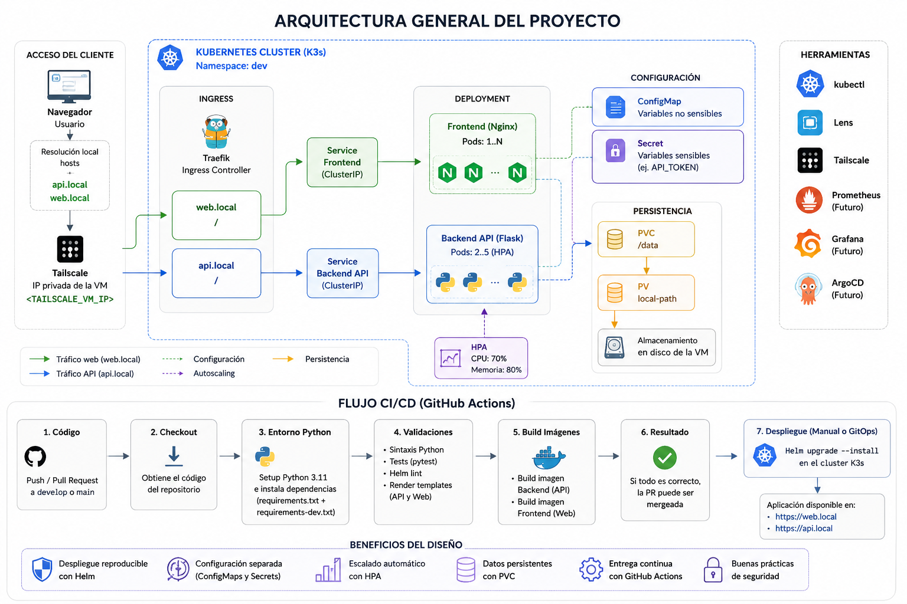
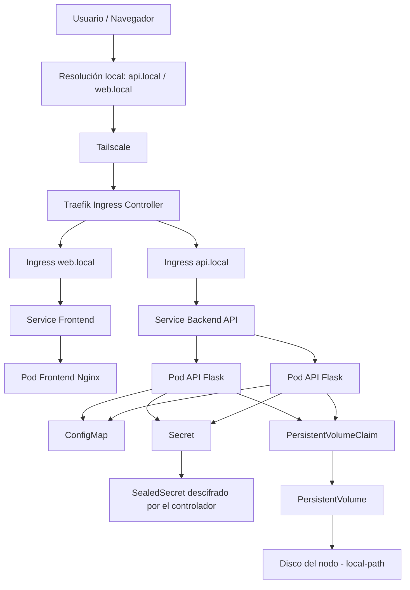
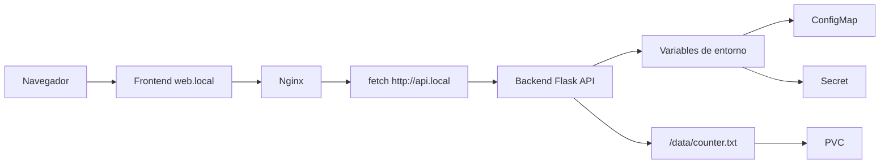
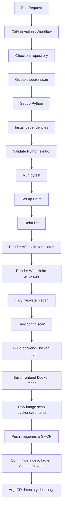
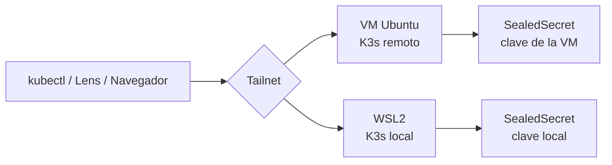

# DevSecOps Kubernetes Lab 🚀

Laboratorio práctico para construir, desplegar y automatizar una aplicación cloud-native sobre Kubernetes, con enfoque en **DevOps, DevSecOps y Platform Engineering**.

El proyecto simula una cadena de entrega de software moderna a pequeña escala:

```text
Código → Tests → CI → Docker → Helm → Kubernetes → Ingress → Configuración → Escalado → Persistencia
```

> Nota de seguridad: este README utiliza placeholders como `<TAILSCALE_VM_IP>`, `<CLUSTER_API_IP>`, `<example-token>` o `<your-path>` para evitar publicar IPs reales, tokens, certificados, kubeconfigs completos, rutas personales o detalles internos del entorno local.

---

## 1. Objetivo del proyecto

El objetivo es construir progresivamente un entorno cloud-native completo, partiendo de una aplicación sencilla y añadiendo capas reales de operación, automatización y seguridad.

El laboratorio cubre:

* Containerización con Docker.
* Despliegue de aplicaciones en Kubernetes.
* Uso de Helm para empaquetado y despliegue.
* Separación frontend/backend.
* Gestión de configuración con ConfigMaps.
* Gestión de secretos con Kubernetes Secrets.
* Exposición mediante Ingress.
* Escalado automático con HPA.
* Persistencia mediante Persistent Volumes y PVC.
* CI con GitHub Actions.
* Validación de código, Helm charts e imágenes Docker.
* Flujo Git basado en ramas feature y Pull Requests.

La aplicación es deliberadamente sencilla. El foco principal está en la plataforma, la automatización, la operación y las buenas prácticas alrededor del ciclo de vida del software.

---

## 2. Vista general del sistema

La siguiente imagen resume la arquitectura general del laboratorio y el flujo de CI/CD implementado:



Esta vista combina los tres bloques principales del proyecto:

* La arquitectura de ejecución sobre Kubernetes, común a los dos entornos: el cluster de la VM y el cluster local sobre WSL2, ambos alcanzables por Tailscale.
* La plataforma que acompaña a la aplicación dentro del propio cluster: Prometheus y Grafana en el namespace `monitoring`, y ArgoCD en `argocd`. Prometheus descubre la API mediante un `ServiceMonitor`.
* El flujo de integración continua sobre GitHub Actions, que valida, escanea, publica las imágenes en GHCR y actualiza el tag en Git para que ArgoCD sincronice el cluster.

El escalado del backend lo gobierna un HPA con objetivos de CPU y memoria, representado en el diagrama por la flecha punteada que apunta al Deployment.

---

## 3. Arquitectura general



---

## 4. Flujo lógico de la aplicación



---

## 5. Stack tecnológico

### Aplicación

* Python
* Flask
* Flask-CORS
* prometheus-flask-exporter
* HTML
* JavaScript
* Nginx

### Contenedores

* Docker
* Dockerfile backend
* Dockerfile frontend

### Kubernetes

* K3s
* Deployments
* Services
* Ingress
* ConfigMaps
* Secrets
* Horizontal Pod Autoscaler
* PersistentVolumeClaims
* StorageClass `local-path`

### Automatización

* Helm
* GitHub Actions
* GitHub Container Registry
* GitFlow simplificado

### Observabilidad

* Prometheus
* Grafana
* Prometheus Operator (ServiceMonitor)
* Alertmanager
* kube-state-metrics
* node-exporter

### GitOps

* ArgoCD
* Application CRD
* Auto-sync con selfHeal y prune

### Gestión de secretos

* Sealed Secrets
* kubeseal
* Gitleaks

### Herramientas de operación

* kubectl
* k9s
* Lens
* Tailscale

---

## 6. Estructura del repositorio

```text
Python-project/
│
├── .github/
│   └── workflows/
│       └── ci.yml
│
├── docs/
│   └── images/
│       └── architecture-overview.png
│
├── frontend/
│   ├── Dockerfile
│   └── index.html
│
├── infra/
│   ├── argocd/
│   │   ├── app-python.yaml
│   │   ├── app-sealed-secrets-controller.yaml
│   │   ├── app-secrets-k3s-lab-wsl.yaml
│   │   ├── app-secrets-ubuntu-devops.yaml
│   │   └── argocd-ingress.yaml
│   │
│   ├── monitoring/
│   │   ├── api-servicemonitor.yaml
│   │   └── grafana-ingress.yaml
│   │
│   └── sealed-secrets/
│       ├── clusters/
│       │   ├── k3s-lab-wsl/
│       │   │   └── api-secret.yaml
│       │   └── ubuntu-devops/
│       │       └── api-secret.yaml
│       └── controller.yaml
│
├── python-app/
│   ├── templates/
│   │   ├── configmap.yaml
│   │   ├── deployment.yaml
│   │   ├── hpa.yaml
│   │   ├── ingress.yaml
│   │   ├── pvc.yaml
│   │   └── service.yaml
│   │
│   ├── Chart.yaml
│   ├── values.yaml
│   ├── values-api.yaml
│   └── values-web.yaml
│
├── tests/
│   └── test_main.py
│
├── Dockerfile
├── main.py
├── requirements.txt
├── requirements-dev.txt
├── pytest.ini
├── .dockerignore
├── .gitignore
└── README.md
```

---

## 7. Componentes de la aplicación

### Backend API

La API está desarrollada con Flask.

Endpoints principales:

```text
GET /
GET /counter
```

El endpoint `/` devuelve información básica de la aplicación:

```json
{
  "message": "Hello from Python API 🚀",
  "app": "python-api",
  "environment": "dev",
  "secret_loaded": true
}
```

El endpoint `/counter` incrementa un contador persistente almacenado en:

```text
/data/counter.txt
```

Ejemplo de respuesta:

```json
{
  "message": "Persistent counter updated",
  "counter": 5,
  "file": "/data/counter.txt"
}
```

Este endpoint se utiliza para validar el comportamiento del volumen persistente cuando los pods son recreados.

---

### Frontend

El frontend se sirve con Nginx y consume la API mediante JavaScript.

Responsabilidades:

* Mostrar una interfaz web simple.
* Consultar el backend.
* Mostrar la respuesta de la API.
* Validar la comunicación frontend/backend dentro del cluster.

---

## 8. Docker

### Backend

Construcción de imagen backend (uso local/desarrollo):

```bash
docker build -t python-k8s-app:latest .
```

### Frontend

Construcción de imagen frontend (uso local/desarrollo):

```bash
cd frontend
docker build -t frontend-app:latest .
```

### Publicación en GHCR (GitHub Container Registry)

El pipeline de CI construye y publica automáticamente ambas imágenes en GHCR en cada push a `develop`/`main`, usando como tag el SHA corto del commit:

```text
ghcr.io/oscarhidalgo93/python-k8s-app:<sha-corto>
ghcr.io/oscarhidalgo93/frontend-app:<sha-corto>
```

El push a GHCR ocurre **después** de que la imagen pase el escaneo de Trivy y **solo** en eventos `push` (no en Pull Requests), para no publicar imágenes de ramas que aún no se han integrado. Ambos paquetes son públicos, por lo que K3s puede hacer `pull` sin necesidad de credenciales.

Con esto, el flujo manual de construir la imagen en la VM, exportarla con `docker save` e importarla en containerd con `sudo k3s ctr images import` **ya no es necesario** para desplegar en el cluster.

---

## 9. Kubernetes

El entorno Kubernetes se ejecuta sobre K3s dentro de una VM Ubuntu.

Namespace principal:

```text
dev
```

Comprobación general:

```bash
kubectl get all -n dev
```

---

## 10. Helm

El proyecto utiliza un único chart Helm reutilizable:

```text
python-app
```

Este chart despliega tanto backend como frontend usando distintos ficheros de values.

### Ficheros Helm principales

```text
values.yaml       → configuración común
values-api.yaml   → configuración específica del backend
values-web.yaml   → configuración específica del frontend
```

El tag de la imagen (`image.tag`) **no se define en los ficheros de values** — se pasa de forma explícita en el momento del despliegue con `--set`, usando el SHA corto del commit que se quiere desplegar (el mismo que generó y publicó el CI en GHCR):

```bash
git rev-parse --short HEAD
```

### Despliegue backend

```bash
cd python-app

helm upgrade --install python-api . \
  -n dev \
  -f values.yaml \
  -f values-api.yaml \
  --set image.tag=<sha-corto> \
  --set secret.apiToken="<token>"
```

### Despliegue frontend

```bash
cd python-app

helm upgrade --install python-web . \
  -n dev \
  -f values.yaml \
  -f values-web.yaml \
  --set image.tag=<sha-corto>
```

### Validación de templates

```bash
helm template test-api . -f values.yaml -f values-api.yaml
helm template test-web . -f values.yaml -f values-web.yaml
```

### Validación del chart

```bash
helm lint .
```

---

## 11. Ingress

K3s incluye Traefik como Ingress Controller por defecto.

Hosts utilizados:

```text
api.local
web.local
```

Ejemplo de resolución local en el equipo cliente:

```text
<TAILSCALE_VM_IP> api.local
<TAILSCALE_VM_IP> web.local
```

Archivo de hosts en Windows:

```text
C:\Windows\System32\drivers\etc\hosts
```

> Se utiliza `<TAILSCALE_VM_IP>` como placeholder para evitar publicar direcciones IP reales del entorno.

---

## 12. ConfigMaps

La configuración no sensible se gestiona mediante ConfigMaps.

Ejemplo:

```yaml
APP_NAME: python-api
ENVIRONMENT: dev
```

Validación:

```bash
kubectl describe configmap python-api-python-app-config -n dev
```

Comprobación dentro del pod:

```bash
kubectl exec -it -n dev <pod-api> -- printenv | grep -E "APP_NAME|ENVIRONMENT"
```

---

## 13. Secrets

Los datos sensibles se gestionan mediante Kubernetes Secrets.

Ejemplo:

```text
API_TOKEN
```

La aplicación no expone el valor del secreto, solo indica si ha sido cargado:

```json
{
  "secret_loaded": true
}
```

Ejemplo seguro para documentación:

```yaml
API_TOKEN: <example-token>
```

Validación:

```bash
kubectl get secrets -n dev
kubectl describe secret python-api-python-app-secret -n dev
```

### Evolución de la gestión de secretos

El proyecto ha pasado por tres etapas, cada una resolviendo el problema de la anterior:

```text
1. apiToken en texto plano en values-api.yaml   → detectable por Gitleaks
2. Inyección con --set en el despliegue         → fuera de Git, paso manual
3. Sealed Secrets                               → cifrado en Git, automático
```

La segunda etapa sacó el valor del repositorio, pero dejó una pieza del estado fuera de Git: había que recordar el `--set` en cada despliegue, y ArgoCD sobrescribía el Secret con una cadena vacía en cada sincronización.

### Sealed Secrets

Sealed Secrets utiliza criptografía asimétrica: `kubeseal` cifra con la clave pública del cluster y solo el controlador, con la clave privada que nunca sale de él, puede descifrar.

Esto permite versionar el secreto **cifrado** en un repositorio público sin riesgo, porque su seguridad no depende de que el repositorio sea privado.

```text
Secret en claro (local, efímero)
      │  kubeseal cifra con la clave pública
      ▼
SealedSecret ─────────────► Git (seguro, aunque sea público)
                                  │  ArgoCD lo aplica
                                  ▼
                       Controlador descifra con la clave privada
                                  ▼
                          Secret normal en el cluster
```

Instalación del controlador, versionado en `infra/sealed-secrets/controller.yaml`:

```bash
kubectl apply -f infra/sealed-secrets/controller.yaml
```

Cliente `kubeseal`:

```bash
curl -sLO https://github.com/bitnami-labs/sealed-secrets/releases/download/v0.39.0/kubeseal-0.39.0-linux-amd64.tar.gz
tar -xzf kubeseal-0.39.0-linux-amd64.tar.gz kubeseal
sudo install -m 755 kubeseal /usr/local/bin/kubeseal
```

Generar y sellar un secreto, sin que el valor en claro llegue nunca al repositorio:

```bash
kubectl create secret generic python-api-python-app-secret \
  --namespace dev \
  --from-literal=API_TOKEN='<token>' \
  --dry-run=client -o yaml > /tmp/secret-claro.yaml

kubeseal --format yaml --controller-namespace kube-system \
  < /tmp/secret-claro.yaml > python-app/templates/sealedsecret.yaml

rm /tmp/secret-claro.yaml
```

El resultado se almacena en `python-app/templates/sealedsecret.yaml` y ArgoCD lo despliega como cualquier otro recurso del chart.

Validación:

```bash
kubectl get secret python-api-python-app-secret -n dev -o jsonpath='{.data.API_TOKEN}' | base64 -d
```

### Consideraciones

* **El nombre importa.** El controlador crea el Secret con el mismo nombre que el SealedSecret, que debe coincidir con el que espera el Deployment.
* **La clave de sellado es propia de cada cluster.** Se genera en el primer arranque del controlador, por lo que un mismo fichero cifrado no sirve para dos entornos: cada cluster necesita su propio sellado del mismo secreto.
* **El sellado está atado a un namespace y un nombre.** Un SealedSecret copiado a otro namespace no se descifra, lo que evita que alguien reutilice el fichero cifrado en un espacio bajo su control.
* **Gitleaks marca los SealedSecrets como falso positivo.** El contenido cifrado tiene alta entropía por definición, indistinguible de un token real. Está acotado por ruta en `.gitleaks.toml` con su justificación.
* **La clave privada del controlador es irremplazable.** Si se pierde el cluster sin haberla respaldado, todos los SealedSecrets quedan ilegibles:

```bash
kubectl get secret -n kube-system -l sealedsecrets.bitnami.com/sealed-secrets-key -o yaml > sealed-secrets-key-backup.yaml
```

> Ese fichero es la llave maestra de todos los secretos del cluster y no debe subirse nunca al repositorio.

* **Sealed Secrets protege el camino hacia Git, no el secreto dentro del cluster.** Una vez descifrado es un Secret normal, legible por cualquiera con permisos de lectura en ese namespace. Restringir ese acceso es trabajo de RBAC.

> No se deben publicar valores reales de Secrets, kubeconfigs completos, certificados, tokens ni credenciales en el repositorio.

---

## 14. HPA - Horizontal Pod Autoscaler

El backend está preparado para escalar automáticamente mediante HPA.

Ejemplo de configuración:

```yaml
autoscaling:
  enabled: true
  minReplicas: 2
  maxReplicas: 5
  targetCPUUtilizationPercentage: 70
  targetMemoryUtilizationPercentage: 80
```

Comprobación:

```bash
kubectl get hpa -n dev
kubectl describe hpa python-api-python-app -n dev
```

Durante las pruebas de carga, la API escaló correctamente hasta 5 pods, validando:

* Metrics Server.
* HPA.
* Requests de CPU/memoria.
* Escalado automático del Deployment.
* Visualización del escalado en Lens.

---

## 15. Persistencia con PVC

La API monta un volumen persistente en:

```text
/data
```

El PVC se crea mediante Helm:

```text
python-api-python-app-pvc
```

Comprobación:

```bash
kubectl get pvc -n dev
```

Ejemplo esperado:

```text
NAME                        STATUS   CAPACITY   ACCESS MODES   STORAGECLASS
python-api-python-app-pvc   Bound    1Gi        RWO            local-path
```

Prueba de persistencia:

```bash
curl http://api.local/counter
curl http://api.local/counter
kubectl delete pod -n dev -l app.kubernetes.io/instance=python-api
curl http://api.local/counter
```

El contador continúa después de recrear los pods, demostrando persistencia real.

> Nota: el contador en fichero es una demo técnica para validar PVC. En un entorno productivo, el estado compartido debería externalizarse en una base de datos, Redis u otro servicio especializado.

---

## 16. Tests con pytest

El proyecto incluye tests básicos con pytest.

Archivo:

```text
tests/test_main.py
```

Los tests validan:

* El endpoint `/`.
* El endpoint `/counter`.
* La lógica de incremento del contador.
* El uso de una ruta temporal para no depender del PVC real durante los tests.

Ejecución local:

```bash
python -m pytest -v
```

Configuración pytest:

```ini
[pytest]
pythonpath = .
testpaths = tests
```

Esto permite importar correctamente `main.py` desde los tests.

---

## 17. Entorno virtual Python

En Ubuntu se recomienda usar un entorno virtual para evitar modificar el Python gestionado por el sistema.

Crear entorno:

```bash
python3 -m venv .venv
```

Activar entorno:

```bash
source .venv/bin/activate
```

Instalar dependencias:

```bash
python -m pip install --upgrade pip
python -m pip install -r requirements.txt
python -m pip install -r requirements-dev.txt
```

Ejecutar tests:

```bash
python -m pytest -v
```

Salir del entorno:

```bash
deactivate
```

> El directorio `.venv/` no debe subirse al repositorio.

---

## 18. GitHub Actions CI

El proyecto incluye una pipeline de CI en:

```text
.github/workflows/ci.yml
```

La pipeline se ejecuta en:

* Push a `develop`.
* Push a `main`.
* Pull Request hacia `develop`.
* Pull Request hacia `main`.

### Flujo de CI



> Los pasos de push a GHCR y de actualización del tag solo se ejecutan en eventos `push` sobre `develop` o `main`, nunca en Pull Requests.

### Validaciones actuales

La CI valida:

* Instalación de dependencias Python.
* Sintaxis de `main.py`.
* Tests con pytest.
* Helm lint.
* Render de templates Helm para API.
* Render de templates Helm para Web.
* Build de imagen Docker backend.
* Build de imagen Docker frontend.
* Gitleaks: detección de secretos en el historial de commits.
* Trivy filesystem scan.
* Trivy config scan sobre el chart Helm.
* Trivy image scan de ambas imágenes Docker.

Esto permite detectar errores antes de integrar cambios en las ramas principales del proyecto.

Además, en push sobre `develop` la pipeline publica las imágenes en GHCR y actualiza el tag en `values-api.yaml`, cerrando el ciclo hacia el despliegue automático mediante ArgoCD.

---

## 19. GitFlow utilizado

Flujo de ramas simplificado:

```text
main
└── develop
    ├── feature/hpa-autoscaling
    ├── feature/persistent-volumes
    ├── feature/github-actions-devsecops-ci
    ├── feature/security-scans
    ├── feature/ghcr-registry
    ├── feature/monitoring
    ├── feature/argocd
    ├── feature/hpa-argocd-fix
    ├── feature/argocd-autosync
    ├── feature/ci-ima-tag
    ├── feature/sealed-secrets
    └── feature/readme
```

Flujo de trabajo:

```text
feature/* → Pull Request → develop → main
```

---

## 20. Acceso remoto con Tailscale

Se utiliza Tailscale para acceder al laboratorio sin depender de la red local.

El kubeconfig apunta a la IP privada de Tailscale de la VM:

```yaml
server: https://<TAILSCALE_VM_IP>:6443
```

K3s fue configurado con `tls-san` para incluir la IP Tailscale en el certificado del API Server:

```yaml
tls-san:
  - <TAILSCALE_VM_IP>
```

Esto permite usar `kubectl` y Lens desde el equipo cliente contra el cluster K3s de la VM.

### Nodo WSL2

El cluster local se incorpora al mismo tailnet, de modo que ambos entornos se alcanzan por el mismo mecanismo y con una identidad que no depende de la red subyacente:

```bash
sudo systemctl enable --now tailscaled
sudo tailscale up --hostname=<NODE_NAME>
```

El certificado del API Server se amplía declarando los nombres adicionales en `/etc/rancher/k3s/config.yaml`:

```yaml
tls-san:
  - <TAILSCALE_WSL_IP>
  - <MAGICDNS_NAME>
```

K3s regenera el certificado al reiniciar el servicio y conserva los SAN anteriores, por lo que las vías de acceso previas siguen siendo válidas. Con `tailscaled` habilitado en systemd, la identidad del nodo sobrevive a los reinicios de la distro.

> Por seguridad, este README no publica IPs reales, tokens, certificados, kubeconfigs completos ni rutas personales del entorno local.

---

## 21. Lens

Lens se utiliza para visualizar y operar el cluster.

Permite revisar:

* Pods.
* Deployments.
* Services.
* Ingress.
* Namespaces.
* HPA.
* PVC.
* Logs.
* Métricas.

Durante la validación del HPA, Lens permitió observar visualmente el escalado de la API hasta 5 pods.

El cliente apunta al nombre estable del cluster en lugar de a una dirección:

```yaml
server: https://<MAGICDNS_NAME>:6443
```

Conviene configurar Lens para que **sincronice un fichero de kubeconfig** en disco (*Preferences → Kubernetes → Kubeconfig Syncs*) en vez de pegar su contenido. Una copia pegada queda congelada en el momento de pegarla y no recoge cambios posteriores, y pegar dos veces el mismo fichero duplica todos sus contextos en el catálogo.

---

## 22. Observabilidad con Prometheus y Grafana

La observabilidad se despliega mediante el chart `kube-prometheus-stack`, que incluye Prometheus, Grafana, Alertmanager, kube-state-metrics y node-exporter.

Namespace utilizado:

```text
monitoring
```

### Instalación

```bash
kubectl create namespace monitoring

helm repo add prometheus-community https://prometheus-community.github.io/helm-charts
helm repo update

helm install kube-prometheus-stack prometheus-community/kube-prometheus-stack \
  -n monitoring \
  --set prometheus.prometheusSpec.resources.requests.cpu=100m \
  --set prometheus.prometheusSpec.resources.requests.memory=512Mi \
  --set prometheus.prometheusSpec.resources.limits.memory=1Gi \
  --set grafana.resources.requests.cpu=50m \
  --set grafana.resources.requests.memory=128Mi
```

> La contraseña de Grafana no se define en ningún fichero del repositorio. Se pasa mediante `--set grafana.adminPassword` en el despliegue o se recupera del Secret que genera el chart automáticamente.

### Acceso a Grafana

Grafana se expone mediante Ingress de Traefik:

```text
grafana.local
```

El manifiesto está en `infra/monitoring/grafana-ingress.yaml`:

```bash
kubectl apply -f infra/monitoring/grafana-ingress.yaml
```

Resolución local en el equipo cliente:

```text
<TAILSCALE_VM_IP> grafana.local
```

El chart incluye dashboards de Kubernetes preconfigurados, que permiten visualizar CPU, memoria y estado de los pods por namespace. Esto complementa el HPA con métricas reales en lugar de solo la salida de `kubectl get hpa`.

### Métricas de la aplicación

La API está instrumentada con `prometheus-flask-exporter`, que expone automáticamente métricas de peticiones, latencia y códigos de respuesta:

```text
GET /metrics
```

Inicialización en `main.py`:

```python
from prometheus_flask_exporter import PrometheusMetrics

app = Flask(__name__)
CORS(app)
metrics = PrometheusMetrics(app, path="/metrics")
```

### ServiceMonitor

Para que Prometheus descubra y consulte la API automáticamente se utiliza un `ServiceMonitor` (CRD del Prometheus Operator), definido en `infra/monitoring/api-servicemonitor.yaml`:

```bash
kubectl apply -f infra/monitoring/api-servicemonitor.yaml
```

Cuatro elementos deben coincidir para que el descubrimiento funcione:

* La label `release: kube-prometheus-stack`, sin la cual el Operator ignora el ServiceMonitor.
* El `namespaceSelector`, ya que el ServiceMonitor vive en `monitoring` y el Service en `dev`.
* El `selector.matchLabels`, que debe coincidir con las labels del Service.
* El nombre del puerto (`port: http`), por lo que el Service define `name: http` en su template.

### Validación

```bash
kubectl get servicemonitor -n monitoring
kubectl port-forward -n monitoring svc/kube-prometheus-stack-prometheus 9090:9090
```

En `http://localhost:9090` → `Status` → `Target health` deben aparecer los targets de la API en estado `UP`.

Ejemplo de consulta en Grafana o Prometheus:

```text
rate(flask_http_request_total[5m])
```

> Nota: el endpoint `/metrics` queda accesible a través del Ingress de la API. En un entorno productivo conviene servirlo en un puerto separado no expuesto públicamente, o restringir el acceso mediante NetworkPolicy para que solo Prometheus pueda consultarlo, ya que expone información sobre rutas, tráfico y errores de la aplicación.

---

## 23. GitOps con ArgoCD

ArgoCD introduce el modelo declarativo: el estado deseado del cluster vive en Git y ArgoCD lo reconcilia de forma continua. El despliegue deja de ser una acción manual (`helm upgrade`) y pasa a ser consecuencia de un commit.

Namespace utilizado:

```text
argocd
```

### Instalación

```bash
kubectl create namespace argocd

helm repo add argo https://argoproj.github.io/argo-helm
helm repo update

helm install argocd argo/argo-cd -n argocd
```

ArgoCD sirve HTTPS por defecto. Para exponerlo detrás de Traefik sin doble terminación TLS se habilita el modo inseguro, aceptable en este laboratorio porque todo el tráfico viaja cifrado por Tailscale:

```bash
helm upgrade argocd argo/argo-cd -n argocd --reuse-values \
  --set configs.params."server\.insecure"=true
```

### Acceso

Ingress definido en `infra/argocd/argocd-ingress.yaml`:

```text
argocd.local
```

Contraseña inicial del usuario `admin`:

```bash
kubectl -n argocd get secret argocd-initial-admin-secret -o jsonpath="{.data.password}" | base64 -d
```

### Application

La Application está declarada en `infra/argocd/app-python.yaml` y vigila el directorio `python-app/` de la rama `develop`:

```yaml
spec:
  source:
    repoURL: https://github.com/oscarHidalgo93/devops-project.git
    targetRevision: develop
    path: python-app
    helm:
      valueFiles:
        - values.yaml
        - values-api.yaml
  destination:
    namespace: dev
  syncPolicy:
    automated:
      prune: true
      selfHeal: true
```

* **`selfHeal`** revierte automáticamente cualquier cambio hecho directamente sobre el cluster.
* **`prune`** elimina recursos que ya no existen en Git. El PVC lleva la anotación `argocd.argoproj.io/sync-options: Prune=false` para que nunca se borre y no se pierdan los datos persistentes.

### Convivencia con el HPA

Con autoescalado activo, el HPA y ArgoCD competían por `spec.replicas`: ArgoCD aplicaba el valor de Git y el HPA lo sobrescribía, dejando la Application permanentemente `OutOfSync`. Con `selfHeal` habilitado, ArgoCD habría forzado además una reducción de réplicas en mitad de un pico de carga.

La solución es no declarar en Git lo que gestiona otro controlador. El template del Deployment omite el campo cuando el autoescalado está activo:

```yaml
spec:
  {{- if not .Values.autoscaling.enabled }}
  replicas: {{ .Values.replicaCount }}
  {{- end }}
```

### Actualización automática del tag de imagen

Tras publicar la imagen en GHCR, el pipeline actualiza `image.tag` en `values-api.yaml` y lo commitea. ArgoCD detecta ese commit y despliega sin intervención manual:

```text
push a develop → CI construye y publica imagen → CI commitea el nuevo tag
               → ArgoCD detecta el commit → reconcilia el cluster
```

El mensaje del commit incluye `[skip ci]` para evitar que el propio commit dispare de nuevo el workflow y se genere un bucle.

Como efecto secundario, el historial de Git pasa a ser el registro de despliegues: cada commit `chore: update image tag to <sha>` corresponde a una versión desplegada, y revertirlo equivale a hacer rollback.

### Applications de infraestructura

El controlador de Sealed Secrets y los secretos sellados se gestionan también por GitOps, con una Application por responsabilidad:

* `sealed-secrets-controller` sincroniza `infra/sealed-secrets` sobre el namespace `kube-system`, con la recursión desactivada para que solo aplique `controller.yaml`.
* `secrets-<cluster>` sincroniza `infra/sealed-secrets/clusters/<cluster>` sobre `dev`. Cada cluster aplica únicamente la Application que le corresponde.

La separación por carpetas es funcional, no estética: los dos SealedSecrets declaran el mismo nombre y el mismo namespace —porque el sellado está atado a ese par— y sincronizar el directorio completo los haría colisionar entre sí.

La Application del controlador lleva `prune: false` de forma deliberada. Su manifiesto incluye el CRD `SealedSecret`, y una poda provocada por una reorganización de rutas borraría ese CRD y, en cascada, todos los SealedSecrets del cluster.

No hay ordenación entre Applications, por lo que la de los secretos puede fallar en su primera sincronización si el CRD todavía no existe. ArgoCD reintenta y converge por sí solo.

### Limitaciones actuales

* La Application solo gestiona el backend. El frontend sigue desplegándose con Helm de forma manual.
* Las Applications se aplican con `kubectl apply`, por lo que un cambio en sus manifiestos no se propaga automáticamente. El patrón *app-of-apps* (una Application raíz que gestione `infra/argocd/`) resolvería esto.

---

## 24. Segundo entorno: K3s local sobre WSL2

Al entorno de la VM se suma un segundo cluster local sobre WSL2, que permite iterar sin depender de la máquina remota y sirve de banco de pruebas para cambios que después se llevan al entorno principal.

Ambos comparten repositorio y chart, pero son clusters **independientes**: cada uno tiene su propio kubeconfig, su propia clave de sellado y su propia identidad de red.



### Instalación

K3s se instala de forma nativa dentro de la distro, con systemd gestionando el servicio y la versión fijada para mantener paridad con el cluster de la VM:

```bash
curl -sfL https://get.k3s.io | INSTALL_K3S_VERSION="v1.36.3+k3s1" INSTALL_K3S_EXEC="--write-kubeconfig-mode 644" sh -
```

Se descarta k3d frente a K3s nativo de forma deliberada. Los nodos de k3d son contenedores y su ciclo de vida lo gobierna el runtime de contenedores; un K3s bajo systemd expone la capa de operación real —`systemctl`, `journalctl`, unidades que fallan y se reintentan solas— que forma parte del objetivo del laboratorio.

El flag `--write-kubeconfig-mode 644` permite leer `/etc/rancher/k3s/k3s.yaml` sin `sudo`. Es asumible en un entorno de un solo usuario, pero no es una práctica trasladable a un servidor compartido: ese fichero contiene credenciales de `cluster-admin`.

### Kubeconfig con varios contextos

El kubeconfig del usuario fusiona los clusters disponibles con nombres explícitos, de modo que el contexto activo sea siempre una decisión consciente:

```bash
kubectl config get-contexts
kubectl config use-context <CONTEXTO>
```

Comprobar `kubectl config current-context` antes de operar es el primer reflejo cuando un resultado no cuadra. Los comandos que crean o destruyen recursos admiten `--context` explícito, lo que convierte un error de ventana en un fallo inofensivo en lugar de un cambio sobre el cluster equivocado.

### Acceso desde el cliente

El reenvío de `localhost` de WSL2 no funciona de forma fiable en el equipo utilizado: las conexiones desde Windows a `127.0.0.1` sobre los puertos del cluster no llegan a destino, pese a estar `localhostForwarding=true` en `.wslconfig`. Se descartaron con datos dos causas habituales —rangos de puertos reservados por WinNAT y una versión antigua de WSL— sin llegar a identificar la raíz.

En lugar de perseguir el síntoma con un script que actualice en cada arranque la IP que reparte el NAT, se opta por eliminar la dependencia: Tailscale dentro de la distro dota al nodo de una identidad de red estable, y la dirección efímera deja de importar.

El motivo por el que ese reenvío tampoco alcanza a Traefik queda recogido en el apartado de troubleshooting: `hostPort` no abre un socket en escucha.

### Sellado de secretos por cluster

La clave privada de Sealed Secrets se genera en el primer arranque del controlador y **pertenece a ese cluster**. Un SealedSecret preparado para la VM no se descifra en el cluster local aunque el namespace y el nombre coincidan.

El laboratorio mantiene por tanto un fichero sellado por entorno, generado contra la clave correspondiente:

```bash
kubectl create secret generic <NOMBRE_DEL_SECRET> -n dev \
  --from-literal=API_TOKEN=<API_TOKEN_VALUE> \
  --dry-run=client -o yaml \
  | kubeseal --format yaml --controller-namespace kube-system > infra/sealed-secrets/clusters/<CLUSTER>/api-secret.yaml
```

`--dry-run=client` construye el objeto en local y lo emite por la salida estándar sin llegar a la API, de modo que el valor en claro nunca se escribe en el cluster.

La alternativa sería compartir la clave privada entre ambos entornos para reutilizar un único fichero. Se descarta de forma consciente: copiar claves privadas entre clusters hace que comprometer uno comprometa el otro, y contradice el modelo de seguridad que la propia herramienta plantea.

---

## 25. Troubleshooting trabajado

Durante el desarrollo se resolvieron incidencias reales relacionadas con:

* Imágenes locales no disponibles en containerd.
* Diferencias entre Docker y containerd en K3s.
* Renderizado de templates Helm con valores no definidos.
* Conflictos de NodePort.
* Configuración de kubeconfig.
* Certificados TLS al acceder por Tailscale.
* Entornos Python gestionados por el sistema operativo.
* Importación de módulos en pytest.
* Validación de PVC y persistencia tras recreación de pods.
* Visibilidad de paquetes en GHCR y errores `ImagePullBackOff`.
* Descubrimiento de targets en Prometheus: la label `release`, el `namespaceSelector` y el nombre del puerto del Service deben coincidir para que el ServiceMonitor genere targets.
* Conflicto entre HPA y ArgoCD por la propiedad de `spec.replicas`.
* Ventana de estabilización del HPA y comportamiento del escalado descendente con métricas de memoria.
* Fallos silenciosos en pipelines: un `sed` que no encuentra coincidencias no devuelve error, por lo que conviene verificar el resultado explícitamente.
* Vulnerabilidades en la imagen base que aparecen sin cambios en el código, al actualizarse la base de datos del escáner.
* Falsos positivos de Gitleaks sobre contenido cifrado: la alta entropía de un SealedSecret es indistinguible de un token real.
* Alcance real de `selfHeal`: revierte modificaciones sobre campos declarados en Git, pero no elimina campos que Git nunca menciona.
* Una línea de `/proc/mounts` con un campo de más impide arrancar al kubelet: su validación del sistema espera exactamente seis campos y no tolera un séptimo. En WSL2 lo provoca la integración de Docker Desktop al montar una ruta de Windows con espacios sin escapar.
* `hostPort` se implementa con reglas DNAT de iptables, no con un socket en escucha. Los mecanismos que detectan puertos abiertos para reenviarlos, como el `localhostForwarding` de WSL2, no llegan a verlo.
* Un `rollout status` agotado por plazo no equivale a un despliegue fallido. La ausencia de un evento `Failed` junto a un `Pulling` reciente indica lentitud, no avería, y la diferencia cambia por completo la acción siguiente.
* La marca de tiempo de un evento pesa tanto como su severidad: un `Warning` del HPA anterior al arranque de los contenedores es ruido de inicialización, no un fallo vigente.
* El porcentaje de utilización que evalúa un HPA se calcula sobre los `requests`, no sobre los `limits`.
* `helm lint` valida estructura y sintaxis, no semántica: un chart que pasa el lint puede renderizar una imagen sin tag o un recurso con el nombre de otro release. `helm template` sí lo detecta, y `required` traslada el fallo del cluster al render.
* Mover un recurso fuera del path que vigila una Application no lo desvincula de ella: conserva su anotación de seguimiento y una sincronización con `prune` lo elimina. Desarmar la sincronización automática antes de reestructurar el repositorio evita que la reconciliación ejecute un cambio a medio hacer.
* Una lista de excepciones definida por rutas concretas se rompe en silencio al mover ficheros: la entrada deja de coincidir sin que nada falle, y el hueco solo se manifiesta cuando vuelve a haber contenido que analizar. Acotarla por patrón resiste mejor la reorganización del repositorio.

---

## 26. Buenas prácticas de seguridad aplicadas

El proyecto aplica varias prácticas básicas de seguridad y limpieza:

* No publicar IPs reales en documentación.
* No publicar tokens reales.
* No publicar kubeconfigs completos.
* No publicar certificados.
* No publicar rutas personales.
* Usar placeholders en ejemplos sensibles.
* Separar dependencias runtime y dependencias de desarrollo.
* Usar Secrets para datos sensibles dentro de Kubernetes.
* Evitar exponer el valor real de los Secrets desde la API.
* Validar cambios mediante Pull Requests y GitHub Actions.
* Escaneo automático de secretos (Gitleaks) e imágenes/config (Trivy) en cada PR.
* Contenedores con `runAsNonRoot`, `readOnlyRootFilesystem` y capabilities mínimas por defecto en el chart.
* Eliminación de herramientas de build (`pip`, `setuptools`, `wheel`) de la imagen en runtime.

---

## 27. Alcance técnico actual

El laboratorio incluye actualmente:

```text
Backend Flask              ✅
Frontend Nginx             ✅
Docker                     ✅
K3s                        ✅
Helm                       ✅
Ingress                    ✅
ConfigMaps                 ✅
Secrets                    ✅
HPA                        ✅
PVC                        ✅
Tailscale                  ✅
Lens                       ✅
pytest                     ✅
GitHub Actions CI          ✅
DevSecOps security scans   ✅
GHCR                       ✅
Prometheus/Grafana         ✅
ArgoCD GitOps              ✅
Sealed Secrets             ✅
K3s local sobre WSL2       ✅
```

---

## 28. Roadmap

Próximas mejoras previstas:

### Seguridad en CI ✅ (completado)

* Gitleaks para detección de secretos.
* Trivy filesystem scan.
* Trivy config scan para manifests Kubernetes/Helm.
* Trivy image scan para imágenes Docker.

### Registry ✅ (completado)

* Publicación de imágenes en GitHub Container Registry.
* Uso de tags basados en commit SHA.
* Eliminación del flujo manual `docker save` + `k3s ctr images import`.

### Observabilidad ✅ (completado)

* Prometheus.
* Grafana.
* Dashboards básicos de Kubernetes.
* Métricas de la API.
* Relación entre HPA y métricas reales.

### GitOps ✅ (completado)

* ArgoCD.
* Sincronización desde Git.
* Despliegue declarativo.
* Actualización automática del tag de imagen desde CI.

### Gestión declarativa de secretos ✅ (completado)

* Sealed Secrets para cifrar valores sensibles y versionarlos en Git.
* Eliminación del `--set secret.apiToken` en el despliegue.

### Supply Chain Security

* SBOM.
* Firma de imágenes.
* Attestations.
* Hardening de GitHub Actions.
* Pinning de actions por SHA.

### Retoques y mejoras finales

Decisiones tomadas conscientemente durante el desarrollo, agrupadas aquí para cerrarlas al final. Ninguna es un descuido: en cada caso se valoró el coste frente al beneficio en el contexto de un laboratorio.

**Cerrar el modelo GitOps**

* Patrón *app-of-apps*: una Application raíz que gestione `infra/`, de forma que los manifiestos de ArgoCD, Prometheus y Sealed Secrets dejen de aplicarse con `kubectl apply` manual.
* Application para el frontend, que aún se despliega con Helm de forma manual.
* Evaluar `ServerSideApply` para que `selfHeal` detecte campos añadidos fuera de Git, que actualmente pasan desapercibidos.
* Sincronizar ArgoCD desde `main` y separar entornos (`develop` → `dev`, `main` → `prod`), acercando el laboratorio a un flujo de promoción real.

**Policy as code**

* Kyverno u OPA Gatekeeper para validar manifiestos en admisión.
* NetworkPolicies entre namespaces.
* Servir `/metrics` en un puerto independiente no expuesto por el Ingress y restringirlo al namespace de monitorización. Actualmente es accesible a través del Ingress de la API.

**Infraestructura como código**

* Ansible para provisionar la VM, K3s y sus dependencias de forma reproducible. Hoy el cluster se monta a mano.

**Calidad y mantenimiento**

* `revisionHistoryLimit` en el Deployment para evitar la acumulación de ReplicaSets antiguos.
* Smoke test en el CI que ejecute el contenedor construido, ya que `docker build` valida la sintaxis pero nunca comprueba que la imagen arranque.
* Reconstrucción periódica programada de las imágenes, para incorporar parches de la base sin depender de que haya cambios en el código.
* Ampliar los tests a casos límite: variables de entorno no definidas y fichero de contador corrupto.
* Migrar Flask del servidor de desarrollo a gunicorn.
* Fijar las imágenes base por digest, requisito previo para SBOM y firma.

**Evolución de la gestión de secretos**

* Vault con External Secrets Operator. A diferencia de Sealed Secrets, el secreto no vive en Git ni siquiera cifrado: el repositorio solo contiene una referencia, lo que permite rotar credenciales sin tocar el código.

---

## 29. Conclusión

Este proyecto representa una base práctica y progresiva para trabajar conceptos de Platform Engineering y DevSecOps mediante construcción real.

La evolución del laboratorio sigue una cadena incremental:

```text
Código versionado
↓
Pull Request
↓
CI
↓
Tests
↓
Validación Helm
↓
Build Docker
↓
Escaneo de seguridad
↓
Registry
↓
Despliegue Kubernetes
↓
Observabilidad
↓
GitOps
```

El foco del laboratorio es aprender haciendo, documentar decisiones técnicas y construir una base cloud-native cada vez más completa, mantenible y automatizada.
