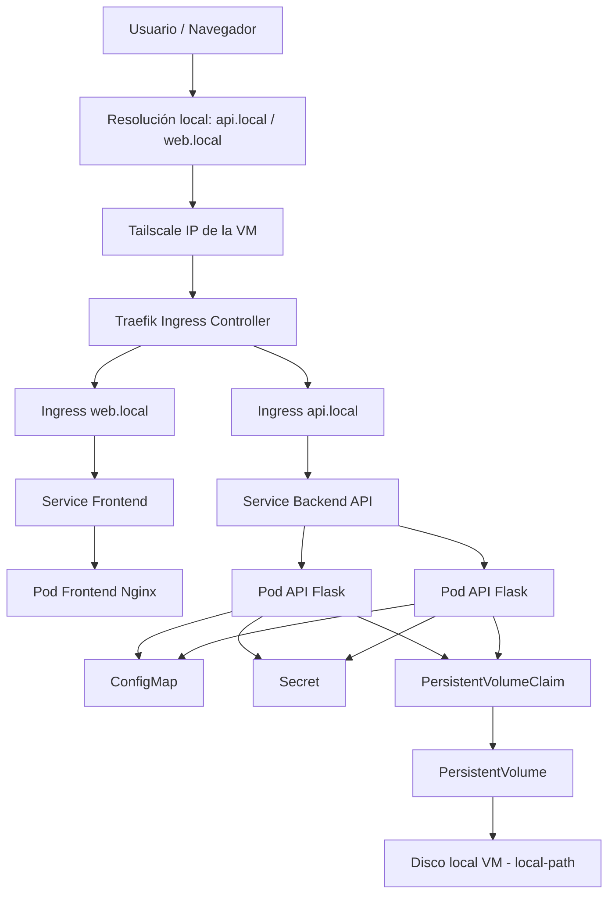
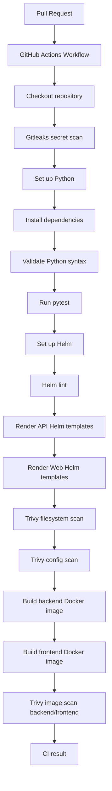

# DevSecOps Kubernetes Lab 🚀

Laboratorio práctico para construir, desplegar y automatizar una aplicación cloud-native sobre Kubernetes, con enfoque en **DevOps, DevSecOps y Platform Engineering**.

El proyecto simula una cadena de entrega de software moderna a pequeña escala:

```text
Código → Tests → CI → Docker → Helm → Kubernetes → Ingress → Configuración → Escalado → Persistencia
```

> Nota de seguridad: este README utiliza placeholders como `<TAILSCALE_VM_IP>`, `<CLUSTER_API_IP>`, `<example-token>` o `<your-path>` para evitar publicar IPs reales, tokens, certificados, kubeconfigs completos, rutas personales o detalles internos del entorno local.

---

## 1. Objetivo del proyecto

El objetivo es construir progresivamente un entorno cloud-native completo, partiendo de una aplicación sencilla y añadiendo capas reales de operación, automatización y seguridad.

El laboratorio cubre:

* Containerización con Docker.
* Despliegue de aplicaciones en Kubernetes.
* Uso de Helm para empaquetado y despliegue.
* Separación frontend/backend.
* Gestión de configuración con ConfigMaps.
* Gestión de secretos con Kubernetes Secrets.
* Exposición mediante Ingress.
* Escalado automático con HPA.
* Persistencia mediante Persistent Volumes y PVC.
* CI con GitHub Actions.
* Validación de código, Helm charts e imágenes Docker.
* Flujo Git basado en ramas feature y Pull Requests.

La aplicación es deliberadamente sencilla. El foco principal está en la plataforma, la automatización, la operación y las buenas prácticas alrededor del ciclo de vida del software.

---

## 2. Vista general del sistema

La siguiente imagen resume la arquitectura general del laboratorio y el flujo de CI/CD implementado:


Esta vista combina los dos bloques principales del proyecto:

* La arquitectura de ejecución sobre Kubernetes.
* El flujo de integración continua basado en GitHub Actions.

---

## 3. Arquitectura general



---

## 4. Flujo lógico de la aplicación

```mermaid
flowchart LR
    Browser[Navegador] --> Web["Frontend web.local"]
    Web --> Nginx["Nginx"]
    Nginx --> ApiCall["fetch http://api.local"]
    ApiCall --> Flask["Backend Flask API"]
    Flask --> Env["Variables de entorno"]
    Env --> CM["ConfigMap"]
    Env --> Sec["Secret]"
    Flask --> Data['/data/counter.txt']
    Data --> PVC["PVC"]
```

---

## 5. Stack tecnológico

### Aplicación

* Python
* Flask
* Flask-CORS
* prometheus-flask-exporter
* HTML
* JavaScript
* Nginx

### Contenedores

* Docker
* Dockerfile backend
* Dockerfile frontend

### Kubernetes

* K3s
* Deployments
* Services
* Ingress
* ConfigMaps
* Secrets
* Horizontal Pod Autoscaler
* PersistentVolumeClaims
* StorageClass `local-path`

### Automatización

* Helm
* GitHub Actions
* GitHub Container Registry
* GitFlow simplificado

### Observabilidad

* Prometheus
* Grafana
* Prometheus Operator (ServiceMonitor)
* Alertmanager
* kube-state-metrics
* node-exporter

### Herramientas de operación

* kubectl
* Lens
* Tailscale

---

## 6. Estructura del repositorio

```text
Python-project/
│
├── .github/
│   └── workflows/
│       └── ci.yml
│
├── docs/
│   └── images/
│       └── architecture-overview.png
│
├── frontend/
│   ├── Dockerfile
│   └── index.html
│
├── infra/
│   └── monitoring/
│       ├── api-servicemonitor.yaml
│       └── grafana-ingress.yaml
│
├── python-app/
│   ├── templates/
│   │   ├── configmap.yaml
│   │   ├── deployment.yaml
│   │   ├── hpa.yaml
│   │   ├── ingress.yaml
│   │   ├── pvc.yaml
│   │   ├── secret.yaml
│   │   └── service.yaml
│   │
│   ├── Chart.yaml
│   ├── values.yaml
│   ├── values-api.yaml
│   └── values-web.yaml
│
├── tests/
│   └── test_main.py
│
├── Dockerfile
├── main.py
├── requirements.txt
├── requirements-dev.txt
├── pytest.ini
├── .dockerignore
├── .gitignore
└── README.md
```

---

## 7. Componentes de la aplicación

### Backend API

La API está desarrollada con Flask.

Endpoints principales:

```text
GET /
GET /counter
```

El endpoint `/` devuelve información básica de la aplicación:

```json
{
  "message": "Hello from Python API 🚀",
  "app": "python-api",
  "environment": "dev",
  "secret_loaded": true
}
```

El endpoint `/counter` incrementa un contador persistente almacenado en:

```text
/data/counter.txt
```

Ejemplo de respuesta:

```json
{
  "message": "Persistent counter updated",
  "counter": 5,
  "file": "/data/counter.txt"
}
```

Este endpoint se utiliza para validar el comportamiento del volumen persistente cuando los pods son recreados.

---

### Frontend

El frontend se sirve con Nginx y consume la API mediante JavaScript.

Responsabilidades:

* Mostrar una interfaz web simple.
* Consultar el backend.
* Mostrar la respuesta de la API.
* Validar la comunicación frontend/backend dentro del cluster.

---

## 8. Docker

### Backend

Construcción de imagen backend (uso local/desarrollo):

```bash
docker build -t python-k8s-app:latest .
```

### Frontend

Construcción de imagen frontend (uso local/desarrollo):

```bash
cd frontend
docker build -t frontend-app:latest .
```

### Publicación en GHCR (GitHub Container Registry)

El pipeline de CI construye y publica automáticamente ambas imágenes en GHCR en cada push a `develop`/`main`, usando como tag el SHA corto del commit:

```text
ghcr.io/oscarhidalgo93/python-k8s-app:<sha-corto>
ghcr.io/oscarhidalgo93/frontend-app:<sha-corto>
```

El push a GHCR ocurre **después** de que la imagen pase el escaneo de Trivy y **solo** en eventos `push` (no en Pull Requests), para no publicar imágenes de ramas que aún no se han integrado. Ambos paquetes son públicos, por lo que K3s puede hacer `pull` sin necesidad de credenciales.

Con esto, el flujo manual de construir la imagen en la VM, exportarla con `docker save` e importarla en containerd con `sudo k3s ctr images import` **ya no es necesario** para desplegar en el cluster.

---

## 9. Kubernetes

El entorno Kubernetes se ejecuta sobre K3s dentro de una VM Ubuntu.

Namespace principal:

```text
dev
```

Comprobación general:

```bash
kubectl get all -n dev
```

---

## 10. Helm

El proyecto utiliza un único chart Helm reutilizable:

```text
python-app
```

Este chart despliega tanto backend como frontend usando distintos ficheros de values.

### Ficheros Helm principales

```text
values.yaml       → configuración común
values-api.yaml   → configuración específica del backend
values-web.yaml   → configuración específica del frontend
```

El tag de la imagen (`image.tag`) **no se define en los ficheros de values** — se pasa de forma explícita en el momento del despliegue con `--set`, usando el SHA corto del commit que se quiere desplegar (el mismo que generó y publicó el CI en GHCR):

```bash
git rev-parse --short HEAD
```

### Despliegue backend

```bash
cd python-app

helm upgrade --install python-api . \
  -n dev \
  -f values.yaml \
  -f values-api.yaml \
  --set image.tag=<sha-corto> \
  --set secret.apiToken="<token>"
```

### Despliegue frontend

```bash
cd python-app

helm upgrade --install python-web . \
  -n dev \
  -f values.yaml \
  -f values-web.yaml \
  --set image.tag=<sha-corto>
```

### Validación de templates

```bash
helm template test-api . -f values.yaml -f values-api.yaml
helm template test-web . -f values.yaml -f values-web.yaml
```

### Validación del chart

```bash
helm lint .
```

---

## 11. Ingress

K3s incluye Traefik como Ingress Controller por defecto.

Hosts utilizados:

```text
api.local
web.local
```

Ejemplo de resolución local en el equipo cliente:

```text
<TAILSCALE_VM_IP> api.local
<TAILSCALE_VM_IP> web.local
```

Archivo de hosts en Windows:

```text
C:\Windows\System32\drivers\etc\hosts
```

> Se utiliza `<TAILSCALE_VM_IP>` como placeholder para evitar publicar direcciones IP reales del entorno.

---

## 12. ConfigMaps

La configuración no sensible se gestiona mediante ConfigMaps.

Ejemplo:

```yaml
APP_NAME: python-api
ENVIRONMENT: dev
```

Validación:

```bash
kubectl describe configmap python-api-python-app-config -n dev
```

Comprobación dentro del pod:

```bash
kubectl exec -it -n dev <pod-api> -- printenv | grep -E "APP_NAME|ENVIRONMENT"
```

---

## 13. Secrets

Los datos sensibles se gestionan mediante Kubernetes Secrets.

Ejemplo:

```text
API_TOKEN
```

La aplicación no expone el valor del secreto, solo indica si ha sido cargado:

```json
{
  "secret_loaded": true
}
```

Ejemplo seguro para documentación:

```yaml
API_TOKEN: <example-token>
```

Validación:

```bash
kubectl get secrets -n dev
kubectl describe secret python-api-python-app-secret -n dev
```

Desde la incorporación de Gitleaks al CI, el token ya no se guarda en texto plano en `values-api.yaml`. Se inyecta en el momento del despliegue:

```bash
helm upgrade --install python-api . -n dev -f values.yaml -f values-api.yaml --set secret.apiToken="<token>"
```

El valor de ejemplo anterior, ya presente en el historial de commits, está documentado y acotado en `.gitleaks.toml` como hallazgo conocido y sin riesgo real.

> No se deben publicar valores reales de Secrets, kubeconfigs completos, certificados, tokens ni credenciales en el repositorio.

---

## 14. HPA - Horizontal Pod Autoscaler

El backend está preparado para escalar automáticamente mediante HPA.

Ejemplo de configuración:

```yaml
autoscaling:
  enabled: true
  minReplicas: 2
  maxReplicas: 5
  targetCPUUtilizationPercentage: 70
  targetMemoryUtilizationPercentage: 80
```

Comprobación:

```bash
kubectl get hpa -n dev
kubectl describe hpa python-api-python-app -n dev
```

Durante las pruebas de carga, la API escaló correctamente hasta 5 pods, validando:

* Metrics Server.
* HPA.
* Requests de CPU/memoria.
* Escalado automático del Deployment.
* Visualización del escalado en Lens.

---

## 15. Persistencia con PVC

La API monta un volumen persistente en:

```text
/data
```

El PVC se crea mediante Helm:

```text
python-api-python-app-pvc
```

Comprobación:

```bash
kubectl get pvc -n dev
```

Ejemplo esperado:

```text
NAME                        STATUS   CAPACITY   ACCESS MODES   STORAGECLASS
python-api-python-app-pvc   Bound    1Gi        RWO            local-path
```

Prueba de persistencia:

```bash
curl http://api.local/counter
curl http://api.local/counter
kubectl delete pod -n dev -l app.kubernetes.io/instance=python-api
curl http://api.local/counter
```

El contador continúa después de recrear los pods, demostrando persistencia real.

> Nota: el contador en fichero es una demo técnica para validar PVC. En un entorno productivo, el estado compartido debería externalizarse en una base de datos, Redis u otro servicio especializado.

---

## 16. Tests con pytest

El proyecto incluye tests básicos con pytest.

Archivo:

```text
tests/test_main.py
```

Los tests validan:

* El endpoint `/`.
* El endpoint `/counter`.
* La lógica de incremento del contador.
* El uso de una ruta temporal para no depender del PVC real durante los tests.

Ejecución local:

```bash
python -m pytest -v
```

Configuración pytest:

```ini
[pytest]
pythonpath = .
testpaths = tests
```

Esto permite importar correctamente `main.py` desde los tests.

---

## 17. Entorno virtual Python

En Ubuntu se recomienda usar un entorno virtual para evitar modificar el Python gestionado por el sistema.

Crear entorno:

```bash
python3 -m venv .venv
```

Activar entorno:

```bash
source .venv/bin/activate
```

Instalar dependencias:

```bash
python -m pip install --upgrade pip
python -m pip install -r requirements.txt
python -m pip install -r requirements-dev.txt
```

Ejecutar tests:

```bash
python -m pytest -v
```

Salir del entorno:

```bash
deactivate
```

> El directorio `.venv/` no debe subirse al repositorio.

---

## 18. GitHub Actions CI

El proyecto incluye una pipeline de CI en:

```text
.github/workflows/ci.yml
```

La pipeline se ejecuta en:

* Push a `develop`.
* Push a `main`.
* Pull Request hacia `develop`.
* Pull Request hacia `main`.

### Flujo de CI



### Validaciones actuales

La CI valida:

* Instalación de dependencias Python.
* Sintaxis de `main.py`.
* Tests con pytest.
* Helm lint.
* Render de templates Helm para API.
* Render de templates Helm para Web.
* Build de imagen Docker backend.
* Build de imagen Docker frontend.
* Gitleaks: detección de secretos en el historial de commits.
* Trivy filesystem scan.
* Trivy config scan sobre el chart Helm.
* Trivy image scan de ambas imágenes Docker.

Esto permite detectar errores antes de integrar cambios en las ramas principales del proyecto.

---

## 19. GitFlow utilizado

Flujo de ramas simplificado:

```text
main
└── develop
    ├── feature/hpa-autoscaling
    ├── feature/persistent-volumes
    ├── feature/github-actions-devsecops-ci
    ├── feature/security-scans
    ├── feature/ghcr-registry
    ├── feature/monitoring
    └── feature/readme
```

Flujo de trabajo:

```text
feature/* → Pull Request → develop → main
```

---

## 20. Acceso remoto con Tailscale

Se utiliza Tailscale para acceder al laboratorio sin depender de la red local.

El kubeconfig apunta a la IP privada de Tailscale de la VM:

```yaml
server: https://<TAILSCALE_VM_IP>:6443
```

K3s fue configurado con `tls-san` para incluir la IP Tailscale en el certificado del API Server:

```yaml
tls-san:
  - <TAILSCALE_VM_IP>
```

Esto permite usar `kubectl` y Lens desde el equipo cliente contra el cluster K3s de la VM.

> Por seguridad, este README no publica IPs reales, tokens, certificados, kubeconfigs completos ni rutas personales del entorno local.

---

## 21. Lens

Lens se utiliza para visualizar y operar el cluster.

Permite revisar:

* Pods.
* Deployments.
* Services.
* Ingress.
* Namespaces.
* HPA.
* PVC.
* Logs.
* Métricas.

Durante la validación del HPA, Lens permitió observar visualmente el escalado de la API hasta 5 pods.

---

## 22. Observabilidad con Prometheus y Grafana

La observabilidad se despliega mediante el chart `kube-prometheus-stack`, que incluye Prometheus, Grafana, Alertmanager, kube-state-metrics y node-exporter.

Namespace utilizado:

```text
monitoring
```

### Instalación

```bash
kubectl create namespace monitoring

helm repo add prometheus-community https://prometheus-community.github.io/helm-charts
helm repo update

helm install kube-prometheus-stack prometheus-community/kube-prometheus-stack \
  -n monitoring \
  --set prometheus.prometheusSpec.resources.requests.cpu=100m \
  --set prometheus.prometheusSpec.resources.requests.memory=512Mi \
  --set prometheus.prometheusSpec.resources.limits.memory=1Gi \
  --set grafana.resources.requests.cpu=50m \
  --set grafana.resources.requests.memory=128Mi
```

> La contraseña de Grafana no se define en ningún fichero del repositorio. Se pasa mediante `--set grafana.adminPassword` en el despliegue o se recupera del Secret que genera el chart automáticamente.

### Acceso a Grafana

Grafana se expone mediante Ingress de Traefik:

```text
grafana.local
```

El manifiesto está en `infra/monitoring/grafana-ingress.yaml`:

```bash
kubectl apply -f infra/monitoring/grafana-ingress.yaml
```

Resolución local en el equipo cliente:

```text
<TAILSCALE_VM_IP> grafana.local
```

El chart incluye dashboards de Kubernetes preconfigurados, que permiten visualizar CPU, memoria y estado de los pods por namespace. Esto complementa el HPA con métricas reales en lugar de solo la salida de `kubectl get hpa`.

### Métricas de la aplicación

La API está instrumentada con `prometheus-flask-exporter`, que expone automáticamente métricas de peticiones, latencia y códigos de respuesta:

```text
GET /metrics
```

Inicialización en `main.py`:

```python
from prometheus_flask_exporter import PrometheusMetrics

app = Flask(__name__)
CORS(app)
metrics = PrometheusMetrics(app, path="/metrics")
```

### ServiceMonitor

Para que Prometheus descubra y consulte la API automáticamente se utiliza un `ServiceMonitor` (CRD del Prometheus Operator), definido en `infra/monitoring/api-servicemonitor.yaml`:

```bash
kubectl apply -f infra/monitoring/api-servicemonitor.yaml
```

Cuatro elementos deben coincidir para que el descubrimiento funcione:

* La label `release: kube-prometheus-stack`, sin la cual el Operator ignora el ServiceMonitor.
* El `namespaceSelector`, ya que el ServiceMonitor vive en `monitoring` y el Service en `dev`.
* El `selector.matchLabels`, que debe coincidir con las labels del Service.
* El nombre del puerto (`port: http`), por lo que el Service define `name: http` en su template.

### Validación

```bash
kubectl get servicemonitor -n monitoring
kubectl port-forward -n monitoring svc/kube-prometheus-stack-prometheus 9090:9090
```

En `http://localhost:9090` → `Status` → `Target health` deben aparecer los targets de la API en estado `UP`.

Ejemplo de consulta en Grafana o Prometheus:

```text
rate(flask_http_request_total[5m])
```

> Nota: el endpoint `/metrics` queda accesible a través del Ingress de la API. En un entorno productivo conviene servirlo en un puerto separado no expuesto públicamente, o restringir el acceso mediante NetworkPolicy para que solo Prometheus pueda consultarlo, ya que expone información sobre rutas, tráfico y errores de la aplicación.

---

## 23. Troubleshooting trabajado

Durante el desarrollo se resolvieron incidencias reales relacionadas con:

* Imágenes locales no disponibles en containerd.
* Diferencias entre Docker y containerd en K3s.
* Renderizado de templates Helm con valores no definidos.
* Conflictos de NodePort.
* Configuración de kubeconfig.
* Certificados TLS al acceder por Tailscale.
* Entornos Python gestionados por el sistema operativo.
* Importación de módulos en pytest.
* Validación de PVC y persistencia tras recreación de pods.
* Visibilidad de paquetes en GHCR y errores `ImagePullBackOff`.
* Descubrimiento de targets en Prometheus: la label `release`, el `namespaceSelector` y el nombre del puerto del Service deben coincidir para que el ServiceMonitor genere targets.

---

## 24. Buenas prácticas de seguridad aplicadas

El proyecto aplica varias prácticas básicas de seguridad y limpieza:

* No publicar IPs reales en documentación.
* No publicar tokens reales.
* No publicar kubeconfigs completos.
* No publicar certificados.
* No publicar rutas personales.
* Usar placeholders en ejemplos sensibles.
* Separar dependencias runtime y dependencias de desarrollo.
* Usar Secrets para datos sensibles dentro de Kubernetes.
* Evitar exponer el valor real de los Secrets desde la API.
* Validar cambios mediante Pull Requests y GitHub Actions.
* Escaneo automático de secretos (Gitleaks) e imágenes/config (Trivy) en cada PR.
* Contenedores con `runAsNonRoot`, `readOnlyRootFilesystem` y capabilities mínimas por defecto en el chart.
* Eliminación de herramientas de build (`pip`, `setuptools`, `wheel`) de la imagen en runtime.

---

## 25. Alcance técnico actual

El laboratorio incluye actualmente:

```text
Backend Flask              ✅
Frontend Nginx             ✅
Docker                     ✅
K3s                        ✅
Helm                       ✅
Ingress                    ✅
ConfigMaps                 ✅
Secrets                    ✅
HPA                        ✅
PVC                        ✅
Tailscale                  ✅
Lens                       ✅
pytest                     ✅
GitHub Actions CI          ✅
DevSecOps security scans   ✅
GHCR                       ✅
Prometheus/Grafana         ✅
ArgoCD GitOps              ⏳
```

---

## 26. Roadmap

Próximas mejoras previstas:

### Seguridad en CI ✅ (completado)

* Gitleaks para detección de secretos.
* Trivy filesystem scan.
* Trivy config scan para manifests Kubernetes/Helm.
* Trivy image scan para imágenes Docker.

### Registry ✅ (completado)

* Publicación de imágenes en GitHub Container Registry.
* Uso de tags basados en commit SHA.
* Eliminación del flujo manual `docker save` + `k3s ctr images import`.

### Observabilidad ✅ (completado)

* Prometheus.
* Grafana.
* Dashboards básicos de Kubernetes.
* Métricas de la API.
* Relación entre HPA y métricas reales.

### GitOps

* ArgoCD.
* Sincronización desde Git.
* Separación de repositorio app/config si aplica.
* Despliegue declarativo.

### Supply Chain Security

* SBOM.
* Firma de imágenes.
* Attestations.
* Hardening de GitHub Actions.
* Pinning de actions por SHA.

---

## 27. Conclusión

Este proyecto representa una base práctica y progresiva para trabajar conceptos de Platform Engineering y DevSecOps mediante construcción real.

La evolución del laboratorio sigue una cadena incremental:

```text
Código versionado
↓
Pull Request
↓
CI
↓
Tests
↓
Validación Helm
↓
Build Docker
↓
Escaneo de seguridad
↓
Registry
↓
Despliegue Kubernetes
↓
Observabilidad
↓
GitOps
```

El foco del laboratorio es aprender haciendo, documentar decisiones técnicas y construir una base cloud-native cada vez más completa, mantenible y automatizada.
